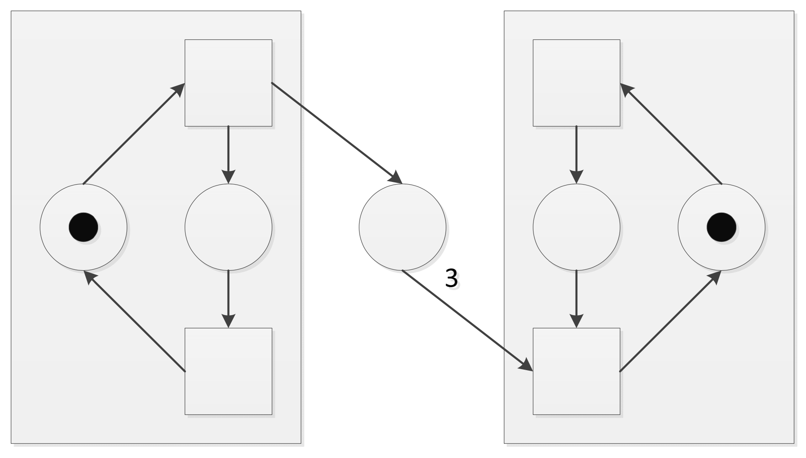

# Questions

## Deadlocks

----

**Welche vier Bedingungen müssen gelten, damit Deadlocks in einem System auftreten können?**

1. **Mutual Exclusion:** Ressourcen werden exklusiv genutzt.
2. **Hold and Wait:** Prozesse/Threads halten Betriebsmittel und warten auf zusätzliche Betriebsmittel.
3. **No Preemption:** Betriebsmittel können ausschließlich durch die Prozesse/Threads freigegeben werden, die sie nutzen.
4. **Circular wait:** Der Wait-For-Graph enthält einen Kreis.

----

**Inwiefern unterscheidet sich Deadlock Avoidance von Deadlock Prevention?**

- Bei **Deadlock Avoidance** soll vermieden werden, dass ein System in einen *unsicheren Zustand* eintritt. Ein *unsicherer Zustand* besteht, wenn keine Ausführungsreihenfolge existiert, bei der alle Threads die von ihnen benötigten Betriebsmittel erhalten und terminieren.
- Prüft vor Ressourcenzuteilung, ob diese zu einem unsicheren Zustand führt, und vermeidet diese, falls dem so ist.
    - Kenntnis über zukünftige Betriebsmittelverfügbarkeit und -anfragen nötig.
    - Nutzt Bankiersalgorithmus.

- Bei **Deadlock Prevention** wird die Belegung von Betriebsmitteln so eingeschränkt, dass mindestens eine notwendige Bedingung für einen Deadlock gar nicht erst eintreten kann.

    - Keine Kenntnis über zukünftige Betriebsmittelverfügbarkeit und -anfragen nötig.

----

**Skizziere einen Deadlock in C.**

```c
sem_t sem;
sem_init(&sem, 0, 2);
pthread_t t1, t2;
//... Create threads
```

Die folgende Ausführungsreihenfolge führt zu einem Deadlock zwischen `t1` und `t2` nach dem vierten Schritt.

| $T_1$             | $T_2$             |
| ----------------- | ----------------- |
| `sem_wait(&sem);` |                   |
|                   | `sem_wait(&sem);` |
| `sem_wait(&sem);` |                   |
|                   | `sem_wait(&sem);` |
|                   | `sem_post(&sem);` |
| `sem_post(&sem);` |                   |

----

**Wie ist ein sicherer Zustand definiert?**

Ein sicherer Zustand liegt genau dann vor, wenn es eine Ausführungsreihenfolge gibt, bei der alle Threads/Prozesse alle Betriebsmittel bekommen, die sie anfragen, und terminieren können.

----

**Ist jeder Deadlock ein unsicherer Zustand? Warum?**

Ja, denn ein Deadlock bedeutet, dass Threads blockiert sind, aufeinander warten, und (ohne externe Intervention) nicht terminieren können.

----

**Ist jeder unsichere Zustand ein Deadlock? Warum?**

Ein unsicherer Zustand ist nicht notwendigerweise ein Deadlock, kann aber zu einem führen. Bei günstiger Ausführungsreihenfolge muss es aber nicht dazu kommen.

----

**Gegeben sei der folgende Systemzustand:**
$$
R = \begin{pmatrix}2 & 1 & 2\\1&1&1\\2&2&0\\0&0&1\end{pmatrix},\quad G=\begin{pmatrix}4&1&2\\3&2&2\\2&2&1\\1&1&4\end{pmatrix},\quad f=\begin{pmatrix}1&0&1\end{pmatrix}
$$
**(i) Berechne mit dem Bankieralgorithmus, ob der angegebene Systemzustand *sicher* ist.**

Der Systemzustand ist sicher.

**(ii) Angenommen der Thread $T_3$ stellt die Teilanforderung $\begin{pmatrix}1&0&0\end{pmatrix}$ an das System. Ist der Systemzustand nach der Erfüllung dieser Teilanforderung sicher? Sollte die Teilanforderung von $T_3$ erfüllt werden?**

Ja, der Systemzustand ist sicher. Die Teilanforderung von $T_3$ kann erfüllt werden.

**(iii)  Beantworte die vorherige Teilaufgabe für den Thread $T_2$ und die Teilanforderung $\begin{pmatrix}0&0&1\end{pmatrix}$.**

Nein, die Teilanforderung führt zu einem unsicheren Zustand und sollte im aktuellen Systemzustand nicht erfüllt werden.

----

**Analysiere die Laufzeit des Bankieralgorithmus.**

$n^2\cdot m$, wobei $n$ die Anzahl der Threads und $m$ die Anzahl der Betriebsmittelarten ist.

----

**Wie praktikabel ist eigentlich der Bankieralgorithmus?**

In der Praxis sind in dynamischen Programmen die Gesamtanfragen bzw. zukünftigen Betriebsmittelanfragen nicht bekannt, daher kann der Bankieralgorithmus dort nicht anwendbar.

----

## Semaphoren und Monitore

----

**Definiere eine Semaphore. Welche Operationen sind für eine Semaphore definiert?**

- Struct mit count und queue
- wait
- post

----

**Ist es wichtig, dass die Operationen aus der vorherigen Frage atomar ausgeführt werden?**

Ja, denn `wait` und `post` bilden jeweils einen kritischen Abschnitt, da sie die *shared resources* `count` und `queue` der Semaphore modifizieren. Bei nicht-atomarer Durchführung kann es zu inkorrektem Programmablauf kommen.

----

**Vergleiche Mutexe und Semaphoren. Was sind Gemeinsamkeiten und Unterschiede?**

- Ein Mutex gestattet zu jedem Zeitpunkt nur einem Thread Zugriff auf die von ihm kontrollierte Ressource.
- Bei Semaphoren bestimmt der Anfangswert von `count`, wie viele Threads gleichzeitig Zugriff erhalten können.
- Ein Semaphor hat die Funktionen `wait` und `post`, während 

----

**Was ist eine binäre Semaphore? Ist eine binäre Semaphore und ein Mutex dasselbe?**

Ein binärer Semaphor ist ein Semaphor, der mit `count = 1` initialisiert wird.

Wird `sem_post()` nur vom Thread aufgerufen, der zuletzt `sem_wait()` aufgerufen hat, so fungiert ein binärer Semaphor praktisch wie ein Mutex.

Konzeptionell ist die Synchronisationssemantik jedoch unterschiedlich, da ein Thread, der ein Mutex per `pthread_mutex_lock()` beansprucht hat, dieses "besitzt", bis er es per `pthread_mutex_unlock()` wieder freigibt.

Ein Semaphor hingegen *kann* `sem_post()` von einem anderen Thread aufrufen, als dem, der `sem_wait()` aufgerufen hat, und eignet sich hiermit für viele Synchronisationsszwecke wie z.B. Producer-Consumer besser.

----

**Beschreibe den Aufbau eines Monitors:**

- **Welche Datenstrukturen können zu einem Monitor gehören?**

- **Welche Operationen sind für einen Monitor definiert?**

...

----

**Skizziere eine Lösung in Pseudocode zu der folgenden Aufgabe[^1]:**

**Auf eine Datei wird durch mehrere Threads ausschließlich lesend zugegriffen. Die TIDs der Threads seien durch paarweise verschiedene natürliche Zahlen gegeben. Zu keinem Zeitpunkt darf jedoch die Summe der TIDs derjenigen Threads, welche aktuell auf die Datei zugreifen, eine initial fest gewählte Schranke $N \in \N$ überschreiten. Entwickle einen Monitor, welcher einen gemeinsamen Zugriff auf die Datei unter der eben genannten Einschränkung realisiert.**

...

----

## Parallel Applications

**Erkläre Foster’s Design Methodology. Welche vier Schritte werden dort genannt und was ist das Ziel jedes einzelnen Schritts?**

...

**Erkläre das BSP Model.**

...

**Angenommen man möchte grob überschlagen, ob es sich lohnt ein bestimmtes serielles Programm zu parallelisieren. Durch Benchmarks hat man ermittelt, dass 80% der Ausführungszeit in Funktionen verbracht wird, die sich gut parallelisieren lassen. Die restlichen 20% der Ausführungszeit wird in Codeabschnitten verbracht, die unbedingt seriell ausgeführt werden müssen (z.B. kritische Abschnitte).**

**(i) Wie hoch ist der erwartete Speed-Up für 6 Prozessoren?**

...

**(ii) Wie hoch ist der erwartete Speed-Up für beliebig viele Prozessoren?**

...

**Ist Amdahl’s Law eine realitätsnahe Abschätzung des zu erwartenden Speed-Up für die Parallelisierung eines Programms?**

...

**Gegeben seien n ganze Zahlen $a_1, a_2, . . ., a_n$. Entwickle mithilfe von *Foster’s Design Methodology* einen parallelen Algorithmus, welcher $\mathrm{min}_{i=1,...,n}a_i$ berechnet.**

...

## OpenMP

**Mit welcher Option kann OpenMP in gcc aktiviert werden?**

...

**Was bedeutet Functional Parallelism?**

...

**Was ist eine Barriere?**

...

**Was ist der Unterschied zwischen `#pragma omp single` und `#pragma omp critical`?**

...

**In der Ankündigung befindet sich ein C-Programm `sum.c`, welches die Summe $\sum_{i=1}^{5.000.000}i$ berechnet. Parallelisiere das Programm mit OpenMP. Das Ergebnis sollte mit der seriellen Version immer noch übereinstimmen. Es steht auf Seite 2 ein Tipp, falls man einen braucht.**

...

**Die Menge ${1, 2, . . . , 20}$ enthält die Primzahlen $2,3,5,7,11,13,17,19$. Die größte Lücke zwischen zwei aufeinanderfolgenden Primzahlen ist hier $4 = 17 - 13 = 11 - 7$. In der Ankündigung befindet sich ein C-Programm `primes_gaps.c`, welches das oben beschriebene Problem für die Menge ${1, 2, . . . , 600000}$ löst. Die Lösung des Problems ist in diesem Fall $114 = 492227 − 492113$.**

**(i)  Parallelisiere das Programm mit OpenMP. Das Ergebnis sollte immer noch 114 sein. Es stehen auf Seite 2 einige Tipps, falls etwas Hilfestellung benötigt wird.**

...

**(ii)  Vergleiche die sequentielle Version aus der Ankündigung und die parallelisierte Version aus Teilaufgabe (i) bezüglich der Ausführungszeit (beispielsweise mit time im Terminal).**

...

**(iii)  Ist der erhaltene Speed-Up zufriedenstellend?**

...

## MPI

**Kompiliere die Datei `mpi_hello_world.c` auf `andorra.imp.fu-berlin.de` und führe das kompilierte Programm mittels `mpirun` aus. Verwende als Argumente `-machinefile Machinefile -np 12`. Die Dateien `mpi_hello_world.c` und `Machinefile` befinden sich im Anhang.**

...

**Vergleiche synchrone Kommunikation mit asynchroner Kommunikation und nenne passende Beispiele aus der Vorlesung über MPI.**

...

**Vergleiche `MPI_Gather` und `MPI_Allgather`.**

...

**Betrachte die Datei `mpi_share_input.c`. Das Programm soll einen String von der Kommandozeile lesen und anschließend soll der Knoten mit Rank 0 diesen String an alle anderen Knoten verteilen. Ergänze in der Datei `mpi_share_input.c` ausschließlich im Bereich "//LÖSUNG ANFANG ... //LÖSUNG ENDE" *MPI Befehle*, sodass das Programm die Aufgabe löst. Kein Prozess sollte beim zweiten `printf(...)` den Text `FIX ME!!!` ausgeben.**

...

**Die Datei `mpi_calc_pi.c` enthält eine angepasste Version von Beispiel *09-06* aus der Vorlesung. Dort wird $\pi$ approximiert, indem man $\int_{0}^1 \frac{4}{1+x^2}dx$ numerisch integriert. Verteile die numerische Berechnung auf mehrere Knoten und verwende am Schluss `MPI_Reduce`, um $\pi$ zu approximieren.**

...

**Die Aufgabe von `mpi_calc_max.c` ist es das Maximum von einem Array mit 100000000 vielen 16-Bit Integer zu berechnen. Teile das Problem mittels *MPI* auf verschiedene Knoten auf. Das Ergebnis ist immer eine fünfstellige Zahl und eindeutig.**

...

**Ist es sinnvoll, OpenMP und MPI zu kombinieren?**

...

## Verteilte Systeme I

**Wie definiert man einen eigenen Thread in Java?**

...

**Was ist (Un-)Marshalling?**

...

**Was ist eine Middleware? Gib ein Beispiel für eine Middleware.**

...

**Vergleiche IPC und RPC.**

...

**Skizziere die Implementierung eines Remote Procedure Calls.**

...

**Vergleiche At-least-once semantics und At-most-once semantics bei RPC Calls. In welchen Szenarien würde man welche RPC Call Semantics bevorzugen?**

...

**Betrachte das Beispiel RPCExample im Github-Repository https://github.com/FUB-HCC/WhiteBoard-Implementation-Examples und erkläre, wie das Beispiel funktioniert.**

...

## Wiederholungsfragen

----

**Es gibt Algorithmen, die...**

- ...deterministisch und determiniert sind. ✅
- ...deterministisch und NICHT determiniert sind. ❌
- ...NICHT deterministisch und determiniert sind. ✅
- ...weder deterministisch noch determiniert sind. ✅

----

**Welche der Aussagen über Prozesse und Threads sind korrekt?**

- Im Gegensatz zu Prozessen haben Threads einen eigenen Adressraum. ❌
- Neben dem Adressraum teilen sich mehrere Threads den Stack vom Prozess. ❌
- Ein Kontextwechsel zwischen zwei Threads im selben Prozess ist in der Regel effizienter als ein Kontextwechsel zwischen zwei verschiedenen Prozessen. ✅
- Ein Prozess hat immer einen eigenen PCB. ✅
- Bei der Verwendung von Prozessen können keine kritische Abschnitte entstehen. ❌
- Prozesse werden auf POSIX Systemen mit dem Syscall `create_process()` erzeugt. ❌

----

**Welche der Aussagen über Lockmechanismen sind korrekt?**

- POSIX-Mutexe funktionieren auf einem modernen Maschinenmodell (Pipelining, Out-of-Order Execution, Caching usw.) mit einer einzigen CPU. ✅
- In der Vorlesung wurden exakt vier Kriterien vorgestellt, die ein "guter" Lock erfüllen muss. ❌
- Die Korrektheit von einem Lockmechanismus hängt vom Maschinenmodell ab. ✅
- Ob (Maschinen-)Instruktionen atomar ausgeführt werden, ist für die Korrektheit eines Locks vollkommen irrelevant. ❌

----

**Welche der Aussagen über Deadlocks sind korrekt?**

- Ein kritischer Abschnitt lässt sich trivial absichern, indem man vor dem Eintritt in den kritischen Abschnitt einen Deadlock erzeugt. ✅
- Ein Deadlock ist ein unsicherer Zustand. ✅
- Mit dem Bankieralgorithmus sorgt man dafür, dass eine der vier Bedingungen für das Auftreten von Deadlocks nicht gilt. ❌
- Beim Dining Philosophers Problem (KEINE SHARED Chopsticks!) lässt sich ein Deadlock vermeiden, indem jeder Philosoph zuerst sein rechtes Essstäbchen aufnimmt und dann sein linkes Essstäbchen bis auf einen Philosophen, der zuerst sein linkes Essstäbchen aufnimmt und anschließend sein rechtes Essstäbchen. Dieses Verfahren ist der Deadlock Prevention zuzuordnen, weil keine Zyklen im Wait-for-Graphen entstehen können. ⁉️
- Ein Deadlock liegt genau dann vor, wenn es einen Zyklus in einem Resource-Allocation-Graphen gibt. ❌

----

**Welche der Aussagen über den Bankieralgorithmus sind korrekt?**

- Der Bankieralgorithmus wird in *Deadlock Avoidance* und *Deadlock Resolution* angewandt. ❌
- Die Laufzeit des Bankieralgorithmus ist $\mathcal{O}(nk^2)$, wobei $n$ = Anzahl Resourcen und $k$ = Anzahl Threads. ✅
- Der Bankieralgorithmus entspricht einer iterativen Reduktion von einem Resource Allocation Graph. Bei einem sicheren Zustand kann man den ursprünglichen Resource Allocation Graph zu einem Graphen mit leerer Kantenmenge reduzieren. ✅
- Ein unsicherer Zustand führt zwangsweise zu einem Deadlock. ❌

----

**Ist dieser Systemzustand sicher?**
$$
B := \begin{pmatrix}0&4\\1&0\\1&0\\2&4\\3&3\end{pmatrix}, \qquad G := \begin{pmatrix}4&6\\2&4\\3&1\\10&6\\4&4\end{pmatrix}, \qquad \vec{f} := \begin{pmatrix}3&2\end{pmatrix}
$$

- Ja ✅
- Nein ❌

*Begründung durch Ausführung des Bankiersalgorithmus:*
$$
\begin{align*}
R &= G - B = \begin{pmatrix}4&2\\1&4\\2&1\\8&2\\1&1\end{pmatrix}\\
\begin{pmatrix}4&2\end{pmatrix} = \vec{r}_1 &\not\le \vec{f} = \begin{pmatrix}3&2\end{pmatrix}\\
\begin{pmatrix}1&4\end{pmatrix} = \vec{r}_2 &\not\le \vec{f} = \begin{pmatrix}3&2\end{pmatrix}\\
\begin{pmatrix}2&1\end{pmatrix} = \vec{r}_3 &\le \vec{f} = \begin{pmatrix}3&2\end{pmatrix}\quad\checkmark\\
\vec{f} &\leftarrow \vec{f} + \vec{b}_3\quad\implies\quad \vec{f} = \begin{pmatrix}4&2\end{pmatrix}\\\\
\begin{pmatrix}4&2\end{pmatrix} = \vec{r}_1 &\le \vec{f}=\begin{pmatrix}4&2\end{pmatrix}\quad\checkmark\\
\vec{f} &\leftarrow \vec{f} + \vec{b}_1\quad\implies\quad \vec{f} = \begin{pmatrix}4&6\end{pmatrix}\\\\
\begin{pmatrix}1&4\end{pmatrix} = \vec{r}_2 &\le \vec{f}= \begin{pmatrix}4&6\end{pmatrix}\quad\checkmark\\
\vec{f} &\leftarrow \vec{f} + \vec{b}_2\quad\implies\quad \vec{f} = \begin{pmatrix}5&6\end{pmatrix}\\\\
\begin{pmatrix}8&2\end{pmatrix} = \vec{r}_4 &\not\le \vec{f}= \begin{pmatrix}5&6\end{pmatrix}\\
\begin{pmatrix}1&1\end{pmatrix} = \vec{r}_5 &\le \vec{f}= \begin{pmatrix}5&6\end{pmatrix}\quad\checkmark\\
\vec{f} &\leftarrow \vec{f} + \vec{b}_5\quad\implies\quad \vec{f} = \begin{pmatrix}8&9\end{pmatrix}\\\\
\begin{pmatrix}8&2\end{pmatrix} = \vec{r}_4 &\le \vec{f}= \begin{pmatrix}8&9\end{pmatrix}\quad\checkmark\\
\vec{f} &\leftarrow \vec{f} + \vec{b}_4\quad\implies\quad \vec{f} = \begin{pmatrix}10&13\end{pmatrix}\\\\
\end{align*}
$$
Die Reihenfolge $(T_3, T_1, T_2, T_5, T_4)$ ermöglicht einen Deadlock-freien Programmablauf.

----

**Welche der Aussagen über Semaphoren sind korrekt?**

- Eine Semaphore besteht aus einem Zähler und einer Datenstruktur für die wartenden Threads/Prozesse. ✅
- Der Zähler einer Semaphore ist immer nichtnegativ. ❌
- Eine Semaphore kann man als eine Erweiterung von einem Lock interpretieren. ✅
- Die Funktion `sem_post()` kann nur von einem Thread aufgerufen werden, der sich gerade in einem kritischen Abschnitt befindet. ❌
- Ein Vorteil von Semaphoren gegenüber Locks ist, dass Deadlocks bei Semaphoren nie auftreten können. ❌

----

## Erstklausur 2020

### Grundlagen (10 Punkte)

**Nebenläufige Programmierung (8 Punkte)**

**Sie programmieren ein Programm mit mehreren Threads, das auf einem System ausgeführt werden soll, welches eine nebenläufige Ausführung unterstützt. Worauf müssen Sie achten? Gehen Sie hierbei auf die Begriffe Korrektheit, deterministische Ausführung, determinierte Ausführung und kritischen Abschnitt im Sinne der Vorlesung ein.**

...

----

**Programmiermodell (2 Punkte)**

**Welche Modelle nutzen Sie bei der Programmierung und in welcher Beziehung müssen diese zu einander stehen, damit eine korrekte Ausführung im Sinne der Vorlesung sichergestellt ist?**

...

----

### Gegenseitiger Ausschluss (16 Punkte)

**Implementierung einer Lösung (8 Punkte)**

**Gegeben sei die folgende Lösung zur Implementierung des gegenseitigen Ausschlusses für zwei Threads. Ist diese Lösung im Sinne der Vorlesung geeignet den gegenseitigen Ausschluss verlässlich sicherzustellen? Erfüllt die Lösung auch die anderen Anforderungen an Lösungen zum Schutz des kritischen Abschnitts, die in der Vorlesung genannt wurden? Begründen Sie Ihre Antwort.**

```c
#include ...
#define NUM_THREADS 2
char _lock[2];


int lock (long tid) {
    _lock[tid] = 1;

    while (_lock[NUM_THREADS - 1 - tid]) {
        _lock[tid] = 0;
        sleep (1);
        _lock[tid] = 1;
        }

return 0;
}

int unlock (long tid) {
    
    _lock[tid] = 0;
    return 0;
}
```

...

----

**Erweiterung einer Lösung (4 Punkte)**

**Wenn die dargestellte Lösung nicht alle Anforderungen im Sinne der Vorlesung erfüllt, welche der in der Vorlesung vorgeschlagenen Lösungen, die nicht auf Betriebssystem- unterstützung zurückgreifen, würden Sie wählen? Begründen Sie Ihre Antwort.**

***Hinweis:***
***Sie können die Lösung beschreiben oder kurz skizzieren, indem Sie die Änderungen am Quell-Code der obigen Lösung angeben.***

...

----

**Unterstützung für die Lösung (4 Punkte)**

**Wann und warum kann es notwendig sein, Hardware- und Betriebssystemunterstützung für den Schutz des kritischen Abschnitts durch gegenseitigen Ausschluss einzufordern?**

...

----

### Modellierung (2 Punkte)

**Was modelliert dieses Petri-Netz?**



...

----

### Verklemmungen (18 Punkte)

**a) Bedingungen (4 Punkte)**

**Nennen Sie alle vier Bedingungen für eine Verklemmung!**

...

----

**b) Art der Ressource (3 Punkte)**

**Wenn wir die CPU als Ressource betrachten, wann kann es nicht zu Verklemmungen kommen? Begründen Sie Ihre Antwort.**

...

----

**c) Bankeralgorithmus (10 Punkte)**

**In einem System mit 5 Prozessen und 4 Betriebsmitteln liege die folgende Betriebsmittelsituation vor mit $G$ für die Gesamtanforderungen, $B$ für die aktuell belegten Ressourcen und $\vec{v}$ als Vektor der grundsätzlich verfügbaren Ressourcen. Wenden Sie den Bankeralgorithmus entsprechend der Vorlesung an, um festzustellen, ob die Situation sicher ist. Geben Sie nach jedem Schritt den Vektor $\vec{f}$ der freien Betriebsmittel, sowie die Menge $DP$ der noch nicht terminierten Prozesse an.**
$$
G:= \begin{pmatrix}2&1&0&0\\5&4&2&1\\6&6&3&2\\5&3&1&3\\5&6&2&3\end{pmatrix},\qquad B:= \begin{pmatrix}2&0&0&0\\3&3&2&1\\1&1&1&1\\1&0&0&1\\1&2&0&2\end{pmatrix},\qquad \vec{v}:=\begin{pmatrix}8&7&3&5\end{pmatrix}
$$
...

----

**d) Bankeralgorithmus II (1 Punkt)**

**Verändern Sie anschließend $\vec{v}$ derart, dass aus einer sicheren eine unsichere bzw. aus einer unsicheren eine sichere Situation wird, während die Gesamtanzahl der verfügbaren Ressourcen $\vec{v}$ unverändert bleibt!**

...

----

### OpenMP (6 Punkte)

**Ergänzen Sie das folgende Programm so, dass die jeweils äußeren `for`-Schleifen parallel ausgeführt werden. Nutzen Sie hierfür OpenMP und die geeignete Befehle aus der gegebenen Auswahl.**

***Hinweise:***
***Achten Sie darauf, welche Variablen wo benutzt werden sollen. Sie können die entsprechenden Nummern für die Quellcode-Zeile und den Befehl angeben. Es dürfen Befehle mehrfach verwendet werden. Nicht alle Befehle müssen eingesetzt werden.***

**Befehle zur Implementierung der Lösung:**

```c
#pragma omp single
#pragma omp parallel
#pragma omp parallel shared (MA, MB, MC, size) private (row, col, i)
#pragma omp parallel privat (MA, MB, MC, size) shared (row, col, i)
#pragma omp for schedule (dynamic)
#pragma omp for schedule (static)
#pragma omp parallel for
#pragma omp parallel for private (x) reduction (+:area)
#pragma omp parallel sections
#pragma omp section
#pragma omp parallel end
#pragma omp barrier
```

````c
#include <omp.h>
double MA[100][100], MB[100][100], MC[100][100];
int i, row, col, size = 100;

int main () {
    read_input (); // MA, MB

    {
        
        for (row = 0; row < size; row++) {
            for (col = 0; col < size; col++)
                MC[row][col] = 0.0;
        }

        for (row = 0; row < size; row++) {
            for (col = 0; col < size; col++)
                for (i = 0; i < size; i++)
                    MC[row][col] += MA[row][i] * !???!
        }
    }
  
    write_output (); // MC
    return 0;
}

````

----

### Parallele Programmierung (8 Punkte)

**Nennen und erläutern Sie kurz im Sinne der Vorlesung die Schritte des Fosterschen Vorgehensmodells zur Entwicklung paralleler Programme am Beispiel der Implementierung eines parallelen Programms zur Matrizenmultiplikation.**

...

----

### Kommunikation mit Sockets (4 Punkte)

**Java stellt Bibliotheksklassen für die Benutzung von Sockets zur Verfügung. Skizzieren Sie den Code bis zu den Stellen, an denen Client und Server mit dem Austausch ihrer Anwendungsdaten beginnen! Achten Sie darauf, dass Client und Server Aktivitäten teilweise aufeinander aufbauend vornehmen und berücksichtigen Sie die zeitliche Reihenfolge.**

**Befehle zur Implementierung der Lösung:**

```java
Socket s = new Socket(clientURL, clientPort);
Socket s = new Socket(serverURL, serverPort);
Socket s = client_s.accept();
Socket s = server_s.accept();
ServerSocket client_s = new ClientSocket(port);
ServerSocket server_s = new ServerSocket(port);
InputStream in = s.getInputStream();
InputStream in = s.getInputStream(s);
OutputStream out = s.getOutputStream();
OutputStream out = s.getOutputStream(s);
```

| Client | Server |
| ------ | ------ |
|        |        |
|        |        |
|        |        |
|        |        |
|        |        |
|        |        |
|        |        |
|        |        |

----

### JavaRMI (12 Punkte)

**Betrachten Sie folgende Implementierung in Java.**

```java
import java.rmi.*;
public interface Abs extends Remote {
    public double abs(Complex x) throws RemoteException;}

import java.rmi.*;
public class AbsImpl implements Abs {
    public double abs(Complex x) {
        return Math.sqrt(x.re * x.re + x.im * x.im);}}

import java.io.Serializable;
public class Complex implements Serializable {
    public double re, im;
    public Complex(double re, double im) {
        this.re = re;
        this.im = im;}}
```

**Ausgabe (4 Punkte)**

**Betrachten Sie folgende Zeile Code:**

```java
System.out.println(a.abs(new Complex(3, 4)));
```

**Wobei `a` ein lokales Objekt der `AbsImpl`-Klasse ist. Was wird auf der Konsole ausgegeben, wenn man die Zeile ausführt?**

...

----

**Ablauf (6 Punkte)**

**Beschreiben Sie in wenigen kurzen Sätzen, was (bezogen auf RMI) passiert, wenn das Objekt `a` aus a) auf ein entferntes `AbsImpl`-Objekt verweist und die Zeile Code ausgeführt wird.**

...

----

**Nutzung nicht-serialisierbarer Objekte (2 Punkte)**

**Was passiert bei der Ausführung der Zeile Code aus a), wenn `a` auf ein entferntes `AbsImpl`-Objekt verweist und die Klasse `Complex` NICHT das Interface `Serializable` implementiert?**

...

----

### Web-Programmierung (6 Punkte)

**Analysieren Sie die folgende Webseite und beantworten Sie diese Fragen:**

```html
<HTML>
    <BODY>
        <SCRIPT language="JavaScript">
        function onSubmit() {
            if(document.pressed == 'Insert')
                document.myForm.action = "insert.html";
            else if(document.pressed == 'Update')
                document.myForm.action = "update.html";
            return true; }
        </SCRIPT>
        <FORM name="myForm" onSubmit="return onSubmit();">
            <INPUT type="submit" name="Operation" value="Insert"
                onClick="document.pressed=this.value" >
            <INPUT type="submit" name="Operation" value="Update"
                onClick="document.pressed=this.value" >
    </BODY>
</HTML>
```

**Erscheinungsbild (1 Punkt)**
**Wie ist das Erscheinungsbild der Webseite? Zeichnen Sie eine Skizze oder beschreiben Sie.**

...

----

**Actions (2 Punkte)**
**Welche actions kann der Benutzer auslösen, und was passiert dann?**

...

----

**Objektzuordnung (1 Punkt)**
**Auf welches DOM-Objekt bezieht sich in `<input …>` das jeweilige `this`?**

...

----

**Eigenschaften des Objekts (1 Punkt)**

**Welche Eigenschaften hat dieses Objekt (jeweils Name und Wert)?**

…

----

**Ersetzung (1 Punkt)**
**Kann man "pressed" überall durch "blablabla" ersetzen? Begründung!**

...

----

### Services (6 Punkte)

**Im Teil der verteilten Entwicklung haben wir immer wieder den Begriff Dienst verwendet, um damit Frage/Antwort-Beziehungen zwischen Client und Servern in verschiedenen Kontexten: (1) TCP Sockets, (2) RMI und (3) Web-Dienste.**

**Nennen und erläutern Sie jeweils mindestens einen grundsätzlichen Unterschied (je 2 Punke) zwischen:**

1. **a)  (1) und (2),**
2. **b)  (2) und (3),**
3. **c)  (1) und (3).**

...

----

### Soundcloud (2 Punkte)

**Anhand von Soundcloud haben wir eine typische Cloud-basierte Datenanalyseplattform kennengelernt. Nennen Sie zwei Gründe, warum sich das Data Analytics Team für die Verwendung einer Cloud-Lösung für die Verwaltung seiner Daten entschieden hat.**

...

----

[^1]: siehe Aufgabe 6.29 in Silberschatz, Abraham, Peter B. Galvin, and Greg Gagne. Operating System Concepts / Abraham Silberschatz ; Peter Baer Galvin ; Greg Gagne. 10. ed.