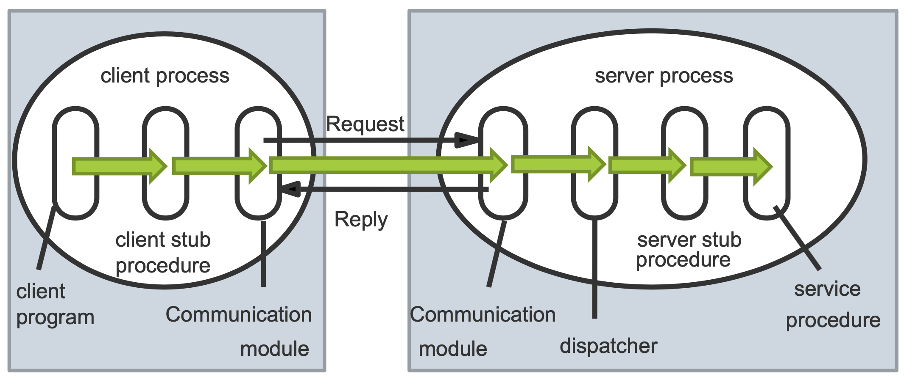
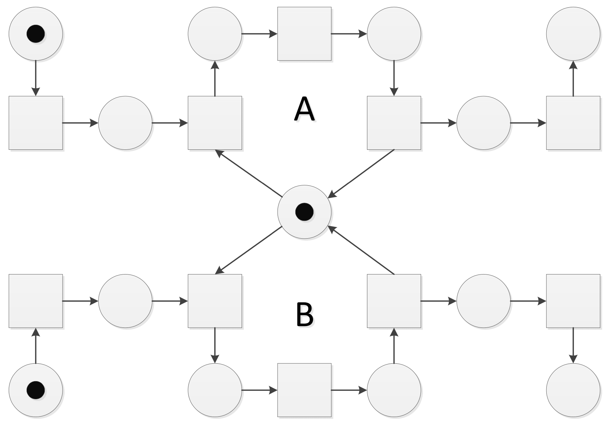
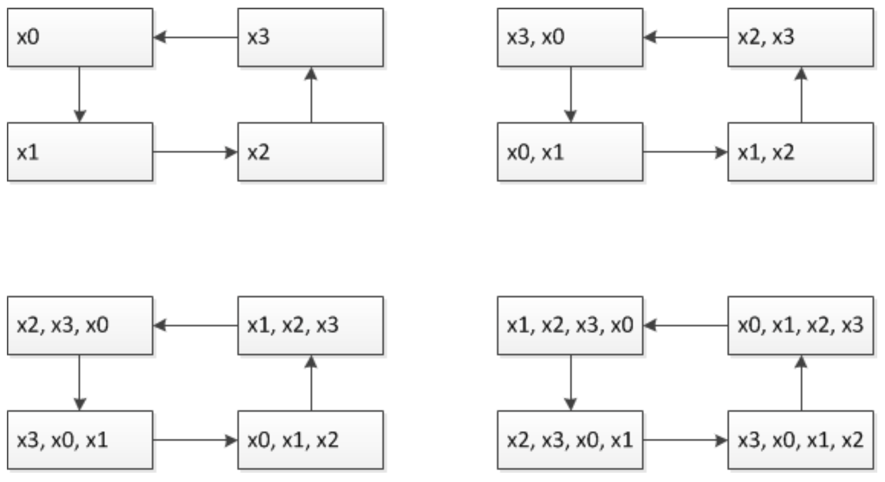
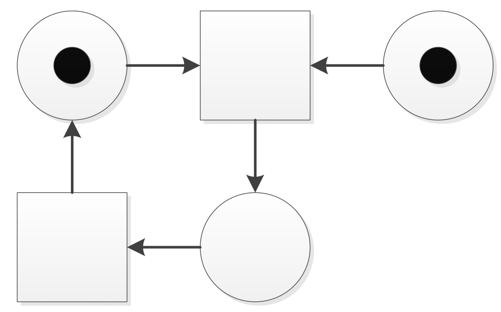

## Tutoriumsaufgaben

### Deadlocks

----

**Welche vier Bedingungen müssen gelten, damit Deadlocks in einem System auftreten können?**

1. **Mutual Exclusion:** Ressourcen werden exklusiv genutzt.
2. **Hold and Wait:** Prozesse/Threads halten Betriebsmittel und warten auf zusätzliche Betriebsmittel.
3. **No Preemption:** Betriebsmittel können ausschließlich durch die Prozesse/Threads freigegeben werden, die sie nutzen.
4. **Circular wait:** Der Wait-For-Graph enthält einen Kreis.

----

**Inwiefern unterscheidet sich Deadlock Avoidance von Deadlock Prevention?**

- Bei **Deadlock Avoidance** soll vermieden werden, dass ein System in einen *unsicheren Zustand* eintritt. Ein *unsicherer Zustand* besteht, wenn keine Ausführungsreihenfolge existiert, bei der alle Threads die von ihnen benötigten Betriebsmittel erhalten und terminieren.
- Prüft vor Ressourcenzuteilung, ob diese zu einem unsicheren Zustand führt, und vermeidet diese, falls dem so ist.
    - Kenntnis über zukünftige Betriebsmittelverfügbarkeit und -anfragen nötig.
    - Nutzt Bankiersalgorithmus.

- Bei **Deadlock Prevention** wird die Belegung von Betriebsmitteln so eingeschränkt, dass mindestens eine notwendige Bedingung für einen Deadlock gar nicht erst eintreten kann.

    - Keine Kenntnis über zukünftige Betriebsmittelverfügbarkeit und -anfragen nötig.

----

**Skizziere einen Deadlock in C.**

```c
sem_t sem;
sem_init(&sem, 0, 2);
pthread_t t1, t2;
//... Create threads
```

Die folgende Ausführungsreihenfolge führt zu einem Deadlock zwischen `t1` und `t2` nach dem vierten Schritt.

| $T_1$             | $T_2$             |
| ----------------- | ----------------- |
| `sem_wait(&sem);` |                   |
|                   | `sem_wait(&sem);` |
| `sem_wait(&sem);` |                   |
|                   | `sem_wait(&sem);` |
|                   | `sem_post(&sem);` |
| `sem_post(&sem);` |                   |

----

**Wie ist ein sicherer Zustand definiert?**

Ein sicherer Zustand liegt genau dann vor, wenn es eine Ausführungsreihenfolge gibt, bei der alle Threads/Prozesse alle Betriebsmittel bekommen, die sie anfragen, und terminieren können.

----

**Ist jeder Deadlock ein unsicherer Zustand? Warum?**

Ja, denn ein Deadlock bedeutet, dass Threads blockiert sind, aufeinander warten, und (ohne externe Intervention) nicht terminieren können.

----

**Ist jeder unsichere Zustand ein Deadlock? Warum?**

Ein unsicherer Zustand ist nicht notwendigerweise ein Deadlock, kann aber zu einem führen. Bei günstiger Ausführungsreihenfolge muss es aber nicht dazu kommen.

----

**Gegeben sei der folgende Systemzustand:**
$$
R = \begin{pmatrix}2 & 1 & 2\\1&1&1\\2&2&0\\0&0&1\end{pmatrix},\quad G=\begin{pmatrix}4&1&2\\3&2&2\\2&2&1\\1&1&4\end{pmatrix},\quad f=\begin{pmatrix}1&0&1\end{pmatrix}
$$
**(i) Berechne mit dem Bankieralgorithmus, ob der angegebene Systemzustand *sicher* ist.**

Der Systemzustand ist sicher.

**(ii) Angenommen der Thread $T_3$ stellt die Teilanforderung $\begin{pmatrix}1&0&0\end{pmatrix}$ an das System. Ist der Systemzustand nach der Erfüllung dieser Teilanforderung sicher? Sollte die Teilanforderung von $T_3$ erfüllt werden?**

Ja, der Systemzustand ist sicher. Die Teilanforderung von $T_3$ kann erfüllt werden.

**(iii)  Beantworte die vorherige Teilaufgabe für den Thread $T_2$ und die Teilanforderung $\begin{pmatrix}0&0&1\end{pmatrix}$.**

Nein, die Teilanforderung führt zu einem unsicheren Zustand und sollte im aktuellen Systemzustand nicht erfüllt werden.

----

**Analysiere die Laufzeit des Bankieralgorithmus.**

$n^2\cdot m$, wobei $n$ die Anzahl der Threads und $m$ die Anzahl der Betriebsmittelarten ist.

----

**Wie praktikabel ist eigentlich der Bankieralgorithmus?**

In der Praxis sind in dynamischen Programmen die Gesamtanfragen bzw. zukünftigen Betriebsmittelanfragen nicht bekannt, daher kann der Bankieralgorithmus dort nicht anwendbar.

----

### Semaphoren und Monitore

----

**Definiere eine Semaphore. Welche Operationen sind für eine Semaphore definiert?**

- Struct mit count und queue
- wait
- post

----

**Ist es wichtig, dass die Operationen aus der vorherigen Frage atomar ausgeführt werden?**

Ja, denn `wait` und `post` bilden jeweils einen kritischen Abschnitt, da sie die *shared resources* `count` und `queue` der Semaphore modifizieren. Bei nicht-atomarer Durchführung kann es zu inkorrektem Programmablauf kommen.

----

**Vergleiche Mutexe und Semaphoren. Was sind Gemeinsamkeiten und Unterschiede?**

- Ein Mutex gestattet zu jedem Zeitpunkt nur einem Thread Zugriff auf die von ihm kontrollierte Ressource.
- Bei Semaphoren bestimmt der Anfangswert von `count`, wie viele Threads gleichzeitig Zugriff erhalten können.
- Ein Semaphor hat die Funktionen `wait` und `post`, während 

----

**Was ist eine binäre Semaphore? Ist eine binäre Semaphore und ein Mutex dasselbe?**

Ein binärer Semaphor ist ein Semaphor, der mit `count = 1` initialisiert wird.

Wird `sem_post()` nur vom Thread aufgerufen, der zuletzt `sem_wait()` aufgerufen hat, so fungiert ein binärer Semaphor praktisch wie ein Mutex.

Konzeptionell ist die Synchronisationssemantik jedoch unterschiedlich, da ein Thread, der ein Mutex per `pthread_mutex_lock()` beansprucht hat, dieses "besitzt", bis er es per `pthread_mutex_unlock()` wieder freigibt.

Ein Semaphor hingegen *kann* `sem_post()` von einem anderen Thread aufrufen, als dem, der `sem_wait()` aufgerufen hat, und eignet sich hiermit für viele Synchronisationsszwecke wie z.B. Producer-Consumer besser.

----

**Beschreibe den Aufbau eines Monitors:**

- **Welche Datenstrukturen können zu einem Monitor gehören?**

- **Welche Operationen sind für einen Monitor definiert?**

1. Mutex und Condition-Variablen.
2. `cwait(c)` process releases the monitor and waits for the following `csignal(c)`, i.e. the occurrence of condition `c`. It then continues in the monitor. The process is blocked in any case.
    `csignal(c)` A waiting process is released. The monitor is occupied again. If there is no waiting process, the procedure has no effect.

❓❓❓❓❓

----

**Skizziere eine Lösung in Pseudocode zu der folgenden Aufgabe[^1]:**

**Auf eine Datei wird durch mehrere Threads ausschließlich lesend zugegriffen. Die TIDs der Threads seien durch paarweise verschiedene natürliche Zahlen gegeben. Zu keinem Zeitpunkt darf jedoch die Summe der TIDs derjenigen Threads, welche aktuell auf die Datei zugreifen, eine initial fest gewählte Schranke $N \in \N$ überschreiten. Entwickle einen Monitor, welcher einen gemeinsamen Zugriff auf die Datei unter der eben genannten Einschränkung realisiert.**

❓❓❓❓❓

----

### Parallel Applications

**Erkläre Foster’s Design Methodology. Welche vier Schritte werden dort genannt und was ist das Ziel jedes einzelnen Schritts?**

1. **Partitioning**: Teilung des Problemraums in möglichst viele unabhängige Programm- oder Datenteile.
2. **Communication**: Effiziente Kommunikation zwischen Tasks.
3. **Agglomeration**: Gruppierung von Tasks, sodass #Tasks mit #CPUs korrespondiert, Erhöhung von Datenlokalität.
4. **Mapping**: Zuweisung gruppierter Tasks an einzelne CPUs zur maximalen CPU-Auslastung.

**Erkläre das BSP Model.**

...

**Angenommen man möchte grob überschlagen, ob es sich lohnt ein bestimmtes serielles Programm zu parallelisieren. Durch Benchmarks hat man ermittelt, dass 80% der Ausführungszeit in Funktionen verbracht wird, die sich gut parallelisieren lassen. Die restlichen 20% der Ausführungszeit wird in Codeabschnitten verbracht, die unbedingt seriell ausgeführt werden müssen (z.B. kritische Abschnitte).**

**(i) Wie hoch ist der erwartete Speed-Up für 6 Prozessoren?**
$$
S(6) = \frac{T(1)}{T(6)} = \frac{1}{0.2 + \frac{0.8}{6}} = 3
$$
**(ii) Wie hoch ist der erwartete Speed-Up für beliebig viele Prozessoren?**
$$
S(p) = \frac{T(1)}{T(p)} = \frac{1}{0.2 + \frac{0.8}{p}}
$$
**Ist Amdahl’s Law eine realitätsnahe Abschätzung des zu erwartenden Speed-Up für die Parallelisierung eines Programms?**

Amdahl's Law ist eine nützliche Heuristik, die jedoch den konkreten Sachverhalt vereinfacht und manche Faktoren außer Acht lässt. Zum Beispiel wird der Overhead durch Prozess-/Threaderstellung sowie -Kommunikation ausgelassen.

Ebenso werden Effizienzgewinne durch Local Caching beim Herunterbrechen des Gesamtproblems auf Teilprobleme mit kleineren Datenmengen (mit denen u.U. $S > p$ erreicht werden kann) durch Amdahl's Law nicht berücksichtigt.

**Gegeben seien n ganze Zahlen $a_1, a_2, . . ., a_n$. Entwickle mithilfe von *Foster’s Design Methodology* einen parallelen Algorithmus, welcher $\mathrm{min}_{i=1,...,n}a_i$ berechnet.**

...

### OpenMP

**Mit welcher Option kann OpenMP in gcc aktiviert werden?**

`-fopenmp`

**Was bedeutet Functional Parallelism?**

Function parallelism bezeichnet die Parallelisierung unterschiedlicher Aufgaben/Operationen auf denselben Daten. Im Gegensatz dazu wird bei Data Parallelism die gleiche Operation parallel auf unterschiedlichen Daten ausgeführt.

**Was ist eine Barriere?**

Eine Barriere ist ein Synchronisierungsmechanismus, bei dem jeder Thread bei Erreichen der Barriere wartet, bis alle anderen Threads ebenfalls die Barriere erreicht haben.

**Was ist der Unterschied zwischen `#pragma omp single` und `#pragma omp critical`?**

- `#pragma omp single` lässt den folgenden Block von nur einem Thread ausführen.
- `#pragma omp critical` lässt den folgenden Block von nur einem Thread gleichzeitig ausführen.

**In der Ankündigung befindet sich ein C-Programm `sum.c`, welches die Summe $\sum_{i=1}^{5.000.000}i$ berechnet. Parallelisiere das Programm mit OpenMP. Das Ergebnis sollte mit der seriellen Version immer noch übereinstimmen. Es steht auf Seite 2 ein Tipp, falls man einen braucht.**

...

**Die Menge ${1, 2, . . . , 20}$ enthält die Primzahlen $2,3,5,7,11,13,17,19$. Die größte Lücke zwischen zwei aufeinanderfolgenden Primzahlen ist hier $4 = 17 - 13 = 11 - 7$. In der Ankündigung befindet sich ein C-Programm `primes_gaps.c`, welches das oben beschriebene Problem für die Menge ${1, 2, . . . , 600000}$ löst. Die Lösung des Problems ist in diesem Fall $114 = 492227 − 492113$.**

**(i)  Parallelisiere das Programm mit OpenMP. Das Ergebnis sollte immer noch 114 sein. Es stehen auf Seite 2 einige Tipps, falls etwas Hilfestellung benötigt wird.**

...

**(ii)  Vergleiche die sequentielle Version aus der Ankündigung und die parallelisierte Version aus Teilaufgabe (i) bezüglich der Ausführungszeit (beispielsweise mit time im Terminal).**

...

**(iii)  Ist der erhaltene Speed-Up zufriedenstellend?**

...

### MPI

**Kompiliere die Datei `mpi_hello_world.c` auf `andorra.imp.fu-berlin.de` und führe das kompilierte Programm mittels `mpirun` aus. Verwende als Argumente `-machinefile Machinefile -np 12`. Die Dateien `mpi_hello_world.c` und `Machinefile` befinden sich im Anhang.**

**Vergleiche synchrone Kommunikation mit asynchroner Kommunikation und nenne passende Beispiele aus der Vorlesung über MPI.**

...

**Vergleiche `MPI_Gather` und `MPI_Allgather`.**

...

**Betrachte die Datei `mpi_share_input.c`. Das Programm soll einen String von der Kommandozeile lesen und anschließend soll der Knoten mit Rank 0 diesen String an alle anderen Knoten verteilen. Ergänze in der Datei `mpi_share_input.c` ausschließlich im Bereich "//LÖSUNG ANFANG ... //LÖSUNG ENDE" *MPI Befehle*, sodass das Programm die Aufgabe löst. Kein Prozess sollte beim zweiten `printf(...)` den Text `FIX ME!!!` ausgeben.**

...

**Die Datei `mpi_calc_pi.c` enthält eine angepasste Version von Beispiel *09-06* aus der Vorlesung. Dort wird $\pi$ approximiert, indem man $\int_{0}^1 \frac{4}{1+x^2}dx$ numerisch integriert. Verteile die numerische Berechnung auf mehrere Knoten und verwende am Schluss `MPI_Reduce`, um $\pi$ zu approximieren.**

...

**Die Aufgabe von `mpi_calc_max.c` ist es das Maximum von einem Array mit 100000000 vielen 16-Bit Integer zu berechnen. Teile das Problem mittels *MPI* auf verschiedene Knoten auf. Das Ergebnis ist immer eine fünfstellige Zahl und eindeutig.**

...

**Ist es sinnvoll, OpenMP und MPI zu kombinieren?**

Es kann sinnvoll sein, sowohl innerhalb eines Prozesses als auch über mehrere CPUs zu parallelisieren.
Dabei wird OpenMP für ersteres und MPI für letzteres genutzt. Wichtig ist, dass MPI-Calls nicht innerhalb eines mit OpenMP parallelisierten Programmabschnitts aufgerufen werden, da dies zu Fehlern führen kann.

### Verteilte Systeme I

**Wie definiert man einen eigenen Thread in Java?**

`Thread thread = new Thread();`

**Was ist (Un-)Marshalling?**

Beim Marshalling werden die Daten (z.B. Funktionsaufruf-Typ und -Argumente) als Nachricht als Bytestream verpackt. Beim Unmarshalling wird die Nachricht wieder "aufgeschlüsselt"... 

**Was ist eine Middleware? Gib ein Beispiel für eine Middleware.**

Als Middleware bezeichnen wir Software, welche die Kommunikation zwischen Systemkomponenten so abstrahiert, dass es für den Programmierenden einfacher wird, Anwendungen zu entwickeln. Middleware vereinfacht die Kooperation von Softwarekomponenten.

**Beispiel:** RMI

**Vergleiche IPC und RPC.**

IPC kann sich auch auf die lokale Kommunikation von Daten (ohne einen Funktionsaufruf) beziehen.

Bei RPC sprechen wir vom Fernaufruf einer Funktion.

**Skizziere die Implementierung eines Remote Procedure Calls.**



**Vergleiche At-least-once semantics und At-most-once semantics bei RPC Calls. In welchen Szenarien würde man welche RPC Call Semantics bevorzugen?**

- Wenn unsere Prozedur nicht idempotent ist, kann at-least-once semantics zu Fehlern führen.
- Bei rechenintensiven Tasks wären *at-most-once* semantics zu bevorzugen, da dort Ergebnisse bei Retransmissions nicht neu berechnet, sondern aus einem Zwischenspeicher nur neu veschickt werden.

**Betrachte das Beispiel RPCExample im Github-Repository https://github.com/FUB-HCC/WhiteBoard-Implementation-Examples und erkläre, wie das Beispiel funktioniert.**

...

## Wiederholungsquiz

----

**Es gibt Algorithmen, die...**

- ...deterministisch und determiniert sind. ✅
- ...deterministisch und NICHT determiniert sind. ❌
    - *Kommentar: Determinismus ⇒ Determiniert*
- ...NICHT deterministisch und determiniert sind. ✅
- ...weder deterministisch noch determiniert sind. ✅

----

**Welche der Aussagen über Prozesse und Threads sind korrekt?**

- Im Gegensatz zu Prozessen haben Threads einen eigenen Adressraum. ❌
- Neben dem Adressraum teilen sich mehrere Threads den Stack vom Prozess. ❌
    - *Kommentar: Jeder Thread hat seinen eigenen Stack.*
- Ein Kontextwechsel zwischen zwei Threads im selben Prozess ist in der Regel effizienter als ein Kontextwechsel zwischen zwei verschiedenen Prozessen. ✅
    - *Kommentar: Kein Wechsel des Adressraums.*
- Ein Prozess hat immer einen eigenen PCB. ✅
- Bei der Verwendung von Prozessen können keine kritische Abschnitte entstehen. ❌
- Prozesse werden auf POSIX Systemen mit dem Syscall `create_process()` erzeugt. ❌
    - *Kommentar: Der Syscall heißt `fork()`.*

----

**Welche der Aussagen über Lockmechanismen sind korrekt?**

- POSIX-Mutexe funktionieren auf einem modernen Maschinenmodell (Pipelining, Out-of-Order Execution, Caching usw.) mit einer einzigen CPU. ✅
    - *Kommentar: Wenn POSIX-Mutexe bei mehreren CPUs funktionieren, dann sicherlich auch bei einer einzigen CPU.*
- In der Vorlesung wurden exakt vier Kriterien vorgestellt, die ein "guter" Lock erfüllen muss. ❌
    - *Kommentar: Es sind **fünf** Kriterien.*
- Die Korrektheit von einem Lockmechanismus hängt vom Maschinenmodell ab. ✅
- Ob (Maschinen-)Instruktionen atomar ausgeführt werden, ist für die Korrektheit eines Locks vollkommen irrelevant. ❌

----

**Welche der Aussagen über Deadlocks sind korrekt?**

- Ein kritischer Abschnitt lässt sich trivial absichern, indem man vor dem Eintritt in den kritischen Abschnitt einen Deadlock erzeugt. ✅
    - *Kommentar: Es ist zwar eine dumme Lösung, aber wenn man sich geschickt anstellt, kann man damit den kritischen Abschnitt absichern. Absicherung = Keine zwei Threads sind gleichzeitig im kritischen Abschnitt.*
- Ein Deadlock ist ein unsicherer Zustand. ✅
- Mit dem Bankieralgorithmus sorgt man dafür, dass eine der vier Bedingungen für das Auftreten von Deadlocks nicht gilt. ❌
    - *Kommentar: Wenn die Aussage stimmen würde, wäre der Bankieralgorithmus auch ein Verfahren der Kategorie Deadlock Prevention. Dies ist jedoch nicht der Fall. Es werden in Deadlock Avoidance keine Bedingungen für die Reihenfolge und Anzahl der Reservierungen von Ressourcen definiert (Beispiele: Preclaiming → Threads sind gezwungen, alle Ressourcen auf einmal zu reservieren, Allocation by Order → Threads sind gezwungen, die Ressourcen in einer fest definierten Reihenfolge zu reservieren). In Deadlock Avoidance wird stattdessen bei jeder Teilanforderung überprüft, ob ein sicherer Zustand bei der Erfüllung der Teilanforderung vorliegt (weil die Bedingungen für das Auftreten von Deadlocks in diesem Szenario gelten! Daher kann man nicht sorglos jede Teilanfor- derung genehmigen). Falls dies der Fall ist, wird die Teilanforderung erfüllt und anderenfalls wird diese nicht erfüllt. Solange sich das System immer in einem sicheren Zustand befindet, vermeidet (= avoided) man Deadlocks.*
- Beim Dining Philosophers Problem (KEINE SHARED Chopsticks!) lässt sich ein Deadlock vermeiden, indem jeder Philosoph zuerst sein rechtes Essstäbchen aufnimmt und dann sein linkes Essstäbchen bis auf einen Philosophen, der zuerst sein linkes Essstäbchen aufnimmt und anschließend sein rechtes Essstäbchen. Dieses Verfahren ist der Deadlock Prevention zuzuordnen, weil keine Zyklen im Wait-for-Graphen entstehen können. ✅
    - *Kommentar: https://cs241.cs.illinois.edu/coursebook/Deadlock#partial-ordering-dijkstras-solution*
- Ein Deadlock liegt genau dann vor, wenn es einen Zyklus in einem Resource-Allocation-Graphen gibt. ❌
    - *Kommentar: Resource-Allocation-Graph $\neq$ Wait-for-Graph.*

----

**Welche der Aussagen über den Bankieralgorithmus sind korrekt?**

- Der Bankieralgorithmus wird in *Deadlock Avoidance* und *Deadlock Resolution* angewandt. ❌
    - *Kommentar: Deadlock Resolution $\neq$ Deadlock Detection.*
- Die Laufzeit des Bankieralgorithmus ist $\mathcal{O}(nk^2)$, wobei $n$ = Anzahl Resourcen und $k$ = Anzahl Threads. ✅
- Der Bankieralgorithmus entspricht einer iterativen Reduktion von einem Resource Allocation Graph. Bei einem sicheren Zustand kann man den ursprünglichen Resource Allocation Graph zu einem Graphen mit leerer Kantenmenge reduzieren. ✅
- Ein unsicherer Zustand führt zwangsweise zu einem Deadlock. ❌
    - *Kommentar: Threads können von sich aus Ressourcen freigeben und dadurch kann man wieder in einen sicheren Zustand gelangen (und von da aus einen Deadlock immer vermeiden).*

----

**Ist dieser Systemzustand sicher?**
$$
B := \begin{pmatrix}0&4\\1&0\\1&0\\2&4\\3&3\end{pmatrix}, \qquad G := \begin{pmatrix}4&6\\2&4\\3&1\\10&6\\4&4\end{pmatrix}, \qquad \vec{f} := \begin{pmatrix}3&2\end{pmatrix}
$$

- Ja ✅
- Nein ❌

*Begründung durch Ausführung des Bankiersalgorithmus:*
$$
\begin{align*}
R &= G - B = \begin{pmatrix}4&2\\1&4\\2&1\\8&2\\1&1\end{pmatrix}\\
\begin{pmatrix}4&2\end{pmatrix} = \vec{r}_1 &\not\le \vec{f} = \begin{pmatrix}3&2\end{pmatrix}\\
\begin{pmatrix}1&4\end{pmatrix} = \vec{r}_2 &\not\le \vec{f} = \begin{pmatrix}3&2\end{pmatrix}\\
\begin{pmatrix}2&1\end{pmatrix} = \vec{r}_3 &\le \vec{f} = \begin{pmatrix}3&2\end{pmatrix}\quad\checkmark\\
\vec{f} &\leftarrow \vec{f} + \vec{b}_3\quad\implies\quad \vec{f} = \begin{pmatrix}4&2\end{pmatrix}\\\\
\begin{pmatrix}4&2\end{pmatrix} = \vec{r}_1 &\le \vec{f}=\begin{pmatrix}4&2\end{pmatrix}\quad\checkmark\\
\vec{f} &\leftarrow \vec{f} + \vec{b}_1\quad\implies\quad \vec{f} = \begin{pmatrix}4&6\end{pmatrix}\\\\
\begin{pmatrix}1&4\end{pmatrix} = \vec{r}_2 &\le \vec{f}= \begin{pmatrix}4&6\end{pmatrix}\quad\checkmark\\
\vec{f} &\leftarrow \vec{f} + \vec{b}_2\quad\implies\quad \vec{f} = \begin{pmatrix}5&6\end{pmatrix}\\\\
\begin{pmatrix}8&2\end{pmatrix} = \vec{r}_4 &\not\le \vec{f}= \begin{pmatrix}5&6\end{pmatrix}\\
\begin{pmatrix}1&1\end{pmatrix} = \vec{r}_5 &\le \vec{f}= \begin{pmatrix}5&6\end{pmatrix}\quad\checkmark\\
\vec{f} &\leftarrow \vec{f} + \vec{b}_5\quad\implies\quad \vec{f} = \begin{pmatrix}8&9\end{pmatrix}\\\\
\begin{pmatrix}8&2\end{pmatrix} = \vec{r}_4 &\le \vec{f}= \begin{pmatrix}8&9\end{pmatrix}\quad\checkmark\\
\vec{f} &\leftarrow \vec{f} + \vec{b}_4\quad\implies\quad \vec{f} = \begin{pmatrix}10&13\end{pmatrix}\\\\
\end{align*}
$$
Die Reihenfolge $(T_3, T_1, T_2, T_5, T_4)$ ermöglicht einen Deadlock-freien Programmablauf.

----

**Welche der Aussagen über Semaphoren sind korrekt?**

- Eine Semaphore besteht aus einem Zähler und einer Datenstruktur für die wartenden Threads/Prozesse. ✅
- Der Zähler einer Semaphore ist immer nichtnegativ. ❌
    - *Kommentar: Ein negativer Zähler gibt die Anzahl der Threads an, die bei einem sem_wait(...) warten.*
- Eine Semaphore kann man als eine Erweiterung von einem Lock interpretieren. ✅
- Die Funktion `sem_post()` kann nur von einem Thread aufgerufen werden, der sich gerade in einem kritischen Abschnitt befindet. ❌
    - *Kommentar: `sem_post(…)` kann von einer beliebigen Stelle im Code aus aufgerufen werden.*
- Ein Vorteil von Semaphoren gegenüber Locks ist, dass Deadlocks bei Semaphoren nie auftreten können. ❌

----

**Welche der Aussagen über Monitore sind korrekt?**

- Unter bestimmten Bedingungen kann ein Monitor von mehreren Threads betreten werden. ❌
    - *Kommentar: In einem Monitor befindet sich zu jedem Zeitpunkt immer nur ein einziger Thread.*
- Eine effiziente Implementierung des Reader-Writer-Problems mit einem Monitor ist nicht möglich,
    weil der Code in einem Monitor immer sequentiell ausgeführt wird. ❌
    - *Kommentar: Effizient = Mehrere Reader können lesen. Eine Implementierung des Problems mit einem Monitor ist in der Ankündigung Beispielcode Monitor 2 (Reader-Writer-Problem) enthalten. Der Monitor selbst reguliert nur den Zugang zum kritischen Abschnitt, enthält diesen jedoch nicht.*
- Ein Monitor ist ein abstrakter Datentyp. ✅
- Der Lock in einem Monitor kann auch durch eine binäre Semaphore ersetzt werden. ❌
    - *Kommentar: Theoretisch stimmt das, aber praktisch werden beispielsweise Condition Variables immer in Kombination mit Mutexen verwendet (siehe die Datentypen der Methoden einer Condition Variable).*

----

**Welche der Aussagen über OpenMP sind korrekt?**

- Der primäre Zweck von `#pragma omp master` und `#pragma omp critical` ist es, kritische Abschnitte abzusichern. ❌
    - *Kommentar: Es geht hier um den **primären** Zweck. `#pragma omp master` ist hier nicht geeignet (nur ein einziger Thread führt den kritischen Abschnitt überhaupt aus).*
- Functional Parallelism wird mit der Pragma-Direktive `#pragma omp parallel` implementiert. Weitere Pragma-Direktiven sind nicht notwendig. ❌
- Die Pragma-Direktiven `#pragma omp critical` und `#pragma omp atomic` sind äquivalent zueinander. ❌
    - Kommentar: `#pragma omp atomic` ist nur sehr beschränkt anwendbar.
- Keine der Antworten trifft zu. ✅

----

**Welche der Aussagen über MPI sind korrekt?**

- Die Methode `MPI_Alltoall` ist deprecated und wurde in MPI-2 zu `MPI_Allgather` umbenannt. ❌
- Der Unterschied zwischen `MPI_Gather` und `MPI_Allgather` ist, dass bei `MPI_Allgather` jeder Knoten die Daten von allen anderen Knoten erhält und bei `MPI_Gather` nur ein einziger Knoten. ✅
- Das "I" in `MPI_Isend` steht für „Immediate“. Das heißt, beim Aufruf von `MPI_Isend` blockiert der Knoten sofort und wartet solange, bis die Sendeoperation abgeschlossen wurde. ❌
- Mit `MPI_Scatter` verteilt ein Wurzelknoten den Inhalt von einem Array auf alle Knoten in einem Kommunikator. ✅
- `MPI_Allgather` kann man auch explizit mit einem Gathering Ring und den Methoden `MPI_Isend` und `MPI_Irecv` implementieren. ❌
    - *Kommentar: Siehe Vorlesung.*

----

**Das Vorgehensmodell nach Ian Foster...**

- ...besteht aus den Superphasen Teile und Herrsche. Das kann man anhand des Hyperquicksort Beispiels aus der Vorlesung gut beobachten. ❌
- ...modelliert die Kommunikation zwischen einzelnen Teilaufgaben, fasst Teilaufgaben mit viel Kommunikation untereinander zusammen und verteilt diese zusammengefassten Teilaufgaben passend auf verschiedene Knoten in einem Netzwerk. ✅
- ...lässt sich sinnvoll auf ein Programm anwenden, welches unbedingt seriell ablaufen muss. ❌
- ...benutzt als Basis das sogenannte Task/Channel-Model. Das Senden und Empfangen von Nachrichten erfolgt hier synchron (z.B. über `MPI_Send` und `MPI_Recv`). ❌
    - Kommentar: Das Senden erfolgt asynchron (z.B. über `MPI_Isend`).

----

**Welche der Aussagen zum BSP Model sind korrekt?**

- Das BSP Model ist ein Synonym für das Vorgehensmodell von Ian Foster. ❌
- Das BSP Model bietet sich gut für die parallele Berechnung des N-Body Problem an. ✅
- Die Abkürzung BSP steht für BBQ Stack Parallelism. ❌

----

**Welche der Aussagen über Verteilungstransparenz sind korrekt?**

- Die Ortstransparenz beschreibt, dass der Zugriff auf Methoden unabhängig davon ist, ob die Methode lokal oder entfernt ist. ❌
    - *Kommentar: Das ist die Beschreibung der Zugriffstransparenz.*
- Die Schnittstellentransparenz besagt, dass man für eine Komponente eine Schnittstelle definiert
    und damit für die Abstraktion von Implementierungsdetails sorgt. ❌
- Die Nebenläufigkeitstransparenz ermöglicht, dass mehrere Nutzer gleichzeitig auf Dienste und Res-
    sourcen zugreifen können. ✅
- Die Zugriffstransparenz beschreibt, dass der genaue Standort von einer Komponente nicht relevant für die Nutzung der Komponente ist. ❌
    - *Kommentar: Das ist die Beschreibung der Ortstransparenz.*

---

**Welche der Aussagen sind korrekt?** 

- Multicast basiert auf TCP. ❌
- Protokolle für P2P-Netzwerke gehören immer der Transportschicht an. ❌
    - *Kommentar: Overlay Networks → Anwendungsschicht.*
- Zur Aufbau einer TCP-Verbindung in Java verwendet ein Server die Klasse `ServerSocket`. ✅

----

**Das Request-Reply-Protokoll...**

-  ...wird sowohl in RMI als auch in RPC verwendet. ✅
- ...lässt sich ausschließlich auf Basis von TCP implementieren. ❌
- ...hat zu hohen Kommunikationsaufwand und wird daher nie genutzt. ❌

----

**Die folgenden Schritte beschreiben den Ablauf eines RPCs. Bringe die Schritte in eine sinnvolle Reihenfolge. **

**✅ Sinnvolle Reihenfolge:**

1. Das Client Program ruft eine Methode von der Client Stub Procedure auf.
2. Die Client Stub Procedure stellt eine Nachricht zusammen. Dafür werden die Argumente der Funktion serialisiert.
3. Die Nachricht wird mittels des Request-Reply-Protokolls an den Server gesendet.
4. Der Dispatcher erhält die Nachricht und übergibt diese der passenden Server Stub Procedure.
5. Die Server Stub Procedure entpackt die Nachricht (Deserialisierung) und ruft mit den entpackten Argumenten die Service Procedure auf.
6. Die Service Procedure führt letztendlich die Methode aus und gibt das Ergebnis (Rückgabewert) an die Server Stub Procedure zurück.
7. Die Server Stub Procedure stellt eine Nachricht zusammen. Dafür wird das Ergebnis des Funktio- nenaufrufs serialisiert.
8. Die Nachricht wird mittels des Request-Reply-Protokolls an den Client zurückgesendet.
9. Die Client Stub Procedure entpackt die Nachricht (Deserialisierung) und übergibt das Ergebnis des entfernten Aufrufs an das Client Program.

----

**Welche der Aussagen über RMI stimmt?**

- Mit der Funktion `Naming.lookup(…)` erhält man von der RMIregistry eine Referenz auf ein Remote Object (beispielsweise über einen Stub). ✅
- Marshalling ist in RMI nicht notwendig. ❌
- RMI ist ein Beispiel für eine Middleware. ✅
- RMI und RPC sind relativ ähnlich in ihrer Funktionsweise. ✅
- Das Remote Reference Module ist für die Übersetzung zwischen lokalen und entfernten Referenzen zuständig. ✅

----

**Eine RMIregistry...**

- ...übernimmt in RMI die Kommunikation zwischen Client und Server mittels des Request-Reply-Protokolls. ❌

- ...ist unter anderem zuständig für die Registrierung von Remote Objects. ✅

- ...leitet Anfragen vom Client and das Skeleton weiter. ❌

----

**Ein unstrukturiertes P2P-Netzwerk...**

- ...ist hoch skalierbar. ❌
    - *Kommentar: Pure P2P mit Flooding ist nicht skalierbar.*

- ...robust gegenüber einzelnen ausgefallenen Knoten. ❌
    - *Kommentar: In Centralized P2P gibt es serverartige Knoten, deren Ausfall das P2P-Netzwerk in seiner Funktion ernsthaft beeinträchtigen kann.*

- ...kommt vollständig ohne Flooding aus. ❌
- Keine der Antworten trifft zu. ✅

----

**Welche der Aussagen über Cloud Computing sind wahr?**

- SaaS, PaaS und IaaS sind alles Beispiele für Service Models. ✅
- Abstraktion und Virtualisierung sind die Kernkonzepte in Cloud Computing. ✅
- SaaS bietet einem Benutzer eine größere Flexibilität als IaaS. ❌

----

## Erstklausur 2020

### Grundlagen (10 Punkte)

**Nebenläufige Programmierung (8 Punkte)**

**Sie programmieren ein Programm mit mehreren Threads, das auf einem System ausgeführt werden soll, welches eine nebenläufige Ausführung unterstützt. Worauf müssen Sie achten? Gehen Sie hierbei auf die Begriffe Korrektheit, deterministische Ausführung, determinierte Ausführung und kritischen Abschnitt im Sinne der Vorlesung ein.**

Um das jeweilige Problem zuverlässig zu lösen, muss unser Programm die funktionale Anforderung der **Korrektheit** erfüllen. Hierfür muss unser Programmiermodell dem Ausführungsmodell, basiert auf dem Maschinenmodell, entsprechen.

**Deterministische Ausführung** (bei welcher der Systemzustand stets gleich und in gleicher Reihenfolge verändert wird) ist bei nebenläufigen Programmen nicht gegeben, da nebenläufig ausgeführte Programminstruktionen in quasi-zufälliger Reihenfolge durchgeführt werden.

**Determinierte Ausführung** (gleicher Input führt stets zu gleichem Output) ist im Allgemeinen jedoch nötig für korrekten Programmablauf.

Als Programmierer müssen wir **kritische Abschnitte** identifizieren, auf die zu jedem Zeitpunkt jeweils nur ein Thread zugreifen darf, um Korrektheit sicherzustellen. Kritische Abschnitte beinhalten Programmabschnitte, in denen Threads auf gemeinsamen Ressourcen arbeiten. In diesen Programmabschnitten muss die Ausführung deterministisch sein.

----

**Programmiermodell (2 Punkte)**

**Welche Modelle nutzen Sie bei der Programmierung und in welcher Beziehung müssen diese zu einander stehen, damit eine korrekte Ausführung im Sinne der Vorlesung sichergestellt ist?**

Programmieren bedeutet die (korrekte) Erstellung eines **Programmiermodells**.

Für eine korrekte Programmausführung muss das Programmiermodell dem **Ausführungsmodell** entsprechen. 

Dieses Ausführungsmodell basiert auf dem **Maschinenmodell**.

----

### Gegenseitiger Ausschluss (16 Punkte)

**Implementierung einer Lösung (8 Punkte)**

**Gegeben sei die folgende Lösung zur Implementierung des gegenseitigen Ausschlusses für zwei Threads. Ist diese Lösung im Sinne der Vorlesung geeignet, den gegenseitigen Ausschluss verlässlich sicherzustellen? Erfüllt die Lösung auch die anderen Anforderungen an Lösungen zum Schutz des kritischen Abschnitts, die in der Vorlesung genannt wurden? Begründen Sie Ihre Antwort.**

```c
#include ...
#define NUM_THREADS 2
char _lock[2];


int lock (long tid) {
    _lock[tid] = 1;

    while (_lock[NUM_THREADS - 1 - tid]) {
        _lock[tid] = 0;
        sleep (1);
        _lock[tid] = 1;
    }

	return 0;
}

int unlock (long tid) {
    
    _lock[tid] = 0;
    return 0;
}
```

- **Mutual Exclusion** wird durch diese Implementierung zuverlässig sichergestellt.

- **Fairness** ist gegeben, da kein Thread dauerhaft bevor-/benachteiligt wird.
- **Low Overhead** ist nicht gegeben, da `sleep(1)` hohe Wartezeiten verursacht. Zudem kann es bei sehr ungünstiger Ausführungsreihenfolge dazu kommen, dass beide Threads viele Male die `while`-Loop durchlaufen, bevor einer den kritischen Eintritt betreten darf.
- **Portability** ist gegeben, da C hier als Hochsprache gilt.
- **Deadlock-Freiheit** ist gegeben, da es hierbei zu keinem Kreis im Wait-For-Graph kommen kann.

----

**Erweiterung einer Lösung (4 Punkte)**

**Wenn die dargestellte Lösung nicht alle Anforderungen im Sinne der Vorlesung erfüllt, welche der in der Vorlesung vorgeschlagenen Lösungen, die nicht auf Betriebssystemunterstützung zurückgreifen, würden Sie wählen? Begründen Sie Ihre Antwort.**

***Hinweis:***
***Sie können die Lösung beschreiben oder kurz skizzieren, indem Sie die Änderungen am Quell-Code der obigen Lösung angeben.***

Lamports Bakery-Algorithmus löst das Problem des hohen Overheads, indem jedem Thread eine Wartenummer zugewiesen wird. Der Thread mit der kleinsten Wartenummer > 0 darf eintreten. Haben beide die gleiche Wartenummer, wird zufällig ein Thread ausgewählt (oder per Thread-ID entschieden, was allerdings nicht komplett fair wäre).

----

**Unterstützung für die Lösung (4 Punkte)**

**Wann und warum kann es notwendig sein, Hardware- und Betriebssystemunterstützung für den Schutz des kritischen Abschnitts durch gegenseitigen Ausschluss einzufordern?**

Hardware- / OS-Unterstützung bringen:

- geringere Fehleranfälligkeit gegegenüber Programmierfehlern
- bessere Performance, da busy waiting vermieden wird, indem wartende Threads geblockt werden
- Berücksichtigung anderer impliziter Parallelisierungsmethoden (Reordering, Pipelining, etc.)

Wenn diese Eigenschaften erwünscht sind, sollte Hardware- / OS-Unterstützung eingefordert werden.

----

### Modellierung (2 Punkte)

**Was modelliert dieses Petri-Netz?**


Dieses Petri-Netz modelliert das Producer-Consumer-Pattern, mit einem Producer (links), einem Consumer (rechts) und einem "Behälter" (dazwischen). Der Producer produziert in einer endlosen Schleife Objekte, die er in den Behälter packt. Sobald es drei Produkte gibt, konsumiert der Consumer diese, und wartet auf die nächsten drei.

----

### Verklemmungen (18 Punkte)

**a) Bedingungen (4 Punkte)**

**Nennen Sie alle vier Bedingungen für eine Verklemmung!**

1. **Mutual Exclusion**: Ressourcen werden exklusiv genutzt.
2. **Hold and Wait**: Threads beanspruchen Zugriff auf Betriebsmittel und fordern zusätzlich Zugriff auf weitere an.
3. **No Preemption**: Betriebsmittel werden ausschließlich durch die Threads freigegeben, die sie nutzen. 
4. **Circular Wait**: Der Wait-For-Graph enthält einen Kreis.

----

**b) Art der Ressource (3 Punkte)**

**Wenn wir die CPU als Ressource betrachten, wann kann es nicht zu Verklemmungen kommen? Begründen Sie Ihre Antwort.**

Wenn nur *eine* CPU (= ein Kern) existiert, sodass dieser zu jedem Zeitpunkt von nur einem Thread beansprucht werden kann, dann ist es nicht möglich, dass der Wait-For-Graph einen Kreis enthält.

----

**c) Bankeralgorithmus (10 Punkte)**

**In einem System mit 5 Prozessen und 4 Betriebsmitteln liege die folgende Betriebsmittelsituation vor mit $G$ für die Gesamtanforderungen, $B$ für die aktuell belegten Ressourcen und $\vec{v}$ als Vektor der grundsätzlich verfügbaren Ressourcen. Wenden Sie den Bankeralgorithmus entsprechend der Vorlesung an, um festzustellen, ob die Situation sicher ist. Geben Sie nach jedem Schritt den Vektor $\vec{f}$ der freien Betriebsmittel, sowie die Menge $DP$ der noch nicht terminierten Prozesse an.**
$$
G:= \begin{pmatrix}2&1&0&0\\5&4&2&1\\6&6&3&2\\5&3&1&3\\5&6&2&3\end{pmatrix},\qquad B:= \begin{pmatrix}2&0&0&0\\3&3&2&1\\1&1&1&1\\1&0&0&1\\1&2&0&2\end{pmatrix},\qquad \vec{v}:=\begin{pmatrix}8&7&3&5\end{pmatrix}
$$
Ja, der Zustand ist sicher! $DP = \emptyset$.

----

**d) Bankeralgorithmus II (1 Punkt)**

**Verändern Sie anschließend $\vec{v}$ derart, dass aus einer sicheren eine unsichere bzw. aus einer unsicheren eine sichere Situation wird, während die Gesamtanzahl der verfügbaren Ressourcen $\vec{v}$ unverändert bleibt!**

$\vec{v} = \begin{pmatrix}8&6&4&5\end{pmatrix}$

----

### OpenMP (6 Punkte)

**Ergänzen Sie das folgende Programm so, dass die jeweils äußeren `for`-Schleifen parallel ausgeführt werden. Nutzen Sie hierfür OpenMP und die geeigneten Befehle aus der gegebenen Auswahl.**

***Hinweise:***
***Achten Sie darauf, welche Variablen wo benutzt werden sollen. Sie können die entsprechenden Nummern für die Quellcode-Zeile und den Befehl angeben. Es dürfen Befehle mehrfach verwendet werden. Nicht alle Befehle müssen eingesetzt werden.***

**Befehle zur Implementierung der Lösung:**

```c
#pragma omp single
#pragma omp parallel
#pragma omp parallel shared (MA, MB, MC, size) private (row, col, i)
#pragma omp parallel privat (MA, MB, MC, size) shared (row, col, i)
#pragma omp for schedule (dynamic)
#pragma omp for schedule (static)
#pragma omp parallel for
#pragma omp parallel for private (x) reduction (+:area)
#pragma omp parallel sections
#pragma omp section
#pragma omp parallel end
#pragma omp barrier
```

````c
#include <omp.h>
double MA[100][100], MB[100][100], MC[100][100];
int i, row, col, size = 100;

int main () {
    read_input (); // MA, MB
#pragma omp parallel shared (MA, MB, MC, size) private (row, col, i)
    {
        #pragma omp for schedule (static)
        for (row = 0; row < size; row++) {
            for (col = 0; col < size; col++)
                MC[row][col] = 0.0;
        }
		#pragma omp for schedule (static)
        for (row = 0; row < size; row++) {
            for (col = 0; col < size; col++)
                for (i = 0; i < size; i++)
                    MC[row][col] += MA[row][i] * !???!
        }
    }
  
    write_output(); // MC
    return 0;
}

````

----

### Parallele Programmierung (8 Punkte)

**Nennen und erläutern Sie kurz im Sinne der Vorlesung die Schritte des Fosterschen Vorgehensmodells zur Entwicklung paralleler Programme am Beispiel der Implementierung eines parallelen Programms zur Matrizenmultiplikation.**

#### Matrizenmultiplikation

Seien $A, B$ die zu multiplizierenden Matrizen und $C$ die Ergebnismatrix.

- **Partitioning**
    - Aufteilung des Gesamtproblems in möglichst viele unabhängige Tasks.
    - Jede Zelle in $C$ ist das Skalarprodukt einer Zeile von $A$ und einer Spalte von $B$.
    - Ein Task kann z.B. ein solches Skalarprodukt sein.

- **Communication**
    - Bestimmung der nötigen Channels zur Kommunikation zwischen Tasks.
    - **Scatter:** Root-Prozess übergibt jeweils eine Zeile aus $A$ und eine Spalte aus $B$ an jeden Skalarprodukt-Task.
    - **Gather:** Am Ende übergeben alle Tasks ihr Ergebnis (Eintrag in $C$) wieder an den Root-Prozess.

- **Agglomeration**
    - Gruppierung der Tasks, sodass #Gruppen mit #CPUs korrespondiert.
    - Tasks, die dieselben Daten benutzen, z.B. die gleiche Zeile aus $A$, sollten als Prozess gruppiert werden.
    - Alle Skalarproduktberechnungen sind unabhängig, es gibt keine Datenabhängigkeit.
    - Bei großen oder nicht-quadratischen Matrizen kann es effizienter sein, nich die gesamte Matrix $B$ zu versenden, sondern nur gewisse Spalten:
        

- **Mapping**
    - Zuweisung gruppierter Tasks an einzelne CPUs.
    - CPU-Auslastung soll maximiert werden, indem ähnlich viele Taskgruppen wie CPUs gibt.
    - In unserem Fall findet Kommunikation nur zwischen Root-Prozess und Skalarprodukt-Prozessen statt.
    - Kommunikationsaufwand soll minimiert werden, in dem Root-Prozess "zentriert" lokalisiert wird.

#### QuickSort

- **Partitioning**
    - Rein funktions- bzw. daten-/domainbasierte Dekomposition ist nicht möglich, da Abhängigkeiten von den Pivot-Elementen bestehen, welche stets erst zur Laufzeit bestimmt werden.
    - Daher wird eine Kombination aus funktions- und datenbasierter Komposition genutzt.
    - Ein Task für die Sortierung jeder Teilliste.
- **Communication**
    - Verteilung der Teillisten an Tasks, von denen sie jeweils sortiert werden.
    - Rückgabe der sortierten Teillisten an die nächsthöhere Ebene des Rekursionsbaums.
- **Agglomeration**
    - Gruppierte Tasks sollten auf der selben Teilliste arbeiten.
    - Gleichverteilung des Rechenaufwands kann nicht sichergestellt werden, da die Pivot-Elemente erst zur Laufzeit bestimmt werden.
- **Mapping**
    - Prozesse werden erzeugt, um Teillisten zu bearbeiten, und müssen diese anschließend an ihren jeweiligen Elternprozess zurückgeben. Für effizientere Kommunikation sollten diese Prozesse nahe beieinander liegen.

#### Hyperquicksort

- **Partitioning & Agglomeration**
    - Gleichverteilung der Liste in $p$ viele Intervalle.
- **Communication**
    - Wenig Kommunikation nötig, da hauptsächlich lokal sortiert wird.
    - Teillisten müssen in $\log(p)$ Operationen ausgetauscht werden.
- **Mapping**
    - Teillisten werden nur innerhalb Teilmengen von Prozessen ausgetauscht, um Netzwerküberladung zu vermeiden.
    - Am Ende ist all-to-all-Kommunikation nötig, daher sollte Knotenabstand gering sein.

#### Sieb des Eratosthenes

- **Partitioning**
    - Aufteilung der Liste von Zahlen von 2 bis $n$ in Intervalle.
    - Aufteilung der Arbeit für unterschiedliche $k$.
    - Ein Task markiert in einem Intervall alle Vielfache für ein $k$. 
- **Communication**
    - Task auf dem gleichen Intervall müssen markierte Zahlen untereinander austauschen.
    - Root-Prozess verteilt Intervalle und $k$-Werte an andere Tasks.
    - Schließlich kommunizieren alle Tasks die markierten Zahlen in ihrem Intervall an Root.
- **Agglomeration**
    - Root-Prozess arbeitet auf dem ersten Intervall von 2 bis mindestens $\left\lfloor\sqrt{n}\right\rfloor$ und broadcastet alle Primzahlen $k$ in seinem Intervall an die anderen Prozesse.
    - Tasks auf dem gleichen Intervall können zu einem Prozess zusammengefasst werden.
    - Kommunikation zwischen Prozessen wird dadurch auf Scatter und Gather von Root reduziert.
- **Mapping**
    - Rechenaufwand ähnlich, da gleich große Intervalle.

#### N-Body Problem

- **Partitioning**
    - Task: Berechnung der nächsten Position *eines* Massepunktes basierend auf der Position aller anderen.
- **Communication**
    - Jeder Massepunkt braucht stets die Masse und aktuelle Position jedes anderen Punkts.
- **Agglomeration**
    - Gleichverteilung der Massepunkte auf Prozesse (angenommen, es gibt mehr Punkte als CPUs).
    - Dies reduziert Kommunikationsoverhead und gewährleistet ausgewogene Inter-Gruppen-Kommunikation.
- **Mapping**
    - Da alle Kommunikation per Broadcasts stattfindet, sollten alle Nodes topologisch nahe beieinander liegen.
    - Wenn Zahl der Gruppen/Prozesse = Anzahl der CPUs, ist der Aufwand balanciert.

----

### Kommunikation mit Sockets (4 Punkte)

**Java stellt Bibliotheksklassen für die Benutzung von Sockets zur Verfügung. Skizzieren Sie den Code bis zu den Stellen, an denen Client und Server mit dem Austausch ihrer Anwendungsdaten beginnen! Achten Sie darauf, dass Client und Server Aktivitäten teilweise aufeinander aufbauend vornehmen und berücksichtigen Sie die zeitliche Reihenfolge.**

**Befehle zur Implementierung der Lösung:**

```java
Socket s = new Socket(clientURL, clientPort);
Socket s = new Socket(serverURL, serverPort);
Socket s = client_s.accept();
Socket s = server_s.accept();
ServerSocket client_s = new ClientSocket(port);
ServerSocket server_s = new ServerSocket(port);
InputStream in = s.getInputStream();
InputStream in = s.getInputStream(s);
OutputStream out = s.getOutputStream();
OutputStream out = s.getOutputStream(s);
```

| Client                                          | Server                                            |
| ----------------------------------------------- | ------------------------------------------------- |
|                                                 | `ServerSocket server_s = new ServerSocket(port);` |
| `Socket s = new Socket(serverURL, serverPort);` |                                                   |
|                                                 | `Socket s = server_s.accept();`                   |
| `OutputStream out = s.getOutputStream();`       |                                                   |
| `InputStream in = s.getInputStream();`          |                                                   |
|                                                 | `OutputStream out = s.getOutputStream();`         |
|                                                 | `InputStream in = s.getInputStream();`            |
|                                                 |                                                   |

----

### JavaRMI (12 Punkte)

**Betrachten Sie folgende Implementierung in Java.**

```java
import java.rmi.*;
public interface Abs extends Remote {
    public double abs(Complex x) throws RemoteException;}

import java.rmi.*;
public class AbsImpl implements Abs {
    public double abs(Complex x) {
        return Math.sqrt(x.re * x.re + x.im * x.im);}}

import java.io.Serializable;
public class Complex implements Serializable {
    public double re, im;
    public Complex(double re, double im) {
        this.re = re;
        this.im = im;}}
```

**Ausgabe (4 Punkte)**

**Betrachten Sie folgende Zeile Code:**

```java
System.out.println(a.abs(new Complex(3, 4)));
```

**Wobei `a` ein lokales Objekt der `AbsImpl`-Klasse ist. Was wird auf der Konsole ausgegeben, wenn man die Zeile ausführt?**

Auf der Konsole wird die Zahl `5` ausgedruckt. Auf dem lokalen Objekt `a` wird die Methode `abs()` mit einem neu erzeugten, ebenfalls lokalen Objekt der `Complex`-Klasse aufgerufen. Alles findet hier lokal statt.  

----

**Ablauf (6 Punkte)**

**Beschreiben Sie in wenigen kurzen Sätzen, was (bezogen auf RMI) passiert, wenn das Objekt `a` aus a) auf ein entferntes `AbsImpl`-Objekt verweist und die Zeile Code ausgeführt wird.**

1. Aufrufendes Objekt ruft die Methode `abs()` auf dem lokalen Stub von `a` auf.
2. Stub marshalled/serialisiert den call type und das Argument `new Complex(3, 4) in eine request message
3. Lookup der Referenz des Remote-Objekts `a` im Remote Reference Module.
4. Communication module schickt Message per Netzwerk an Server und blockt den aufrufenden Client-Thread.
5. Communication module des Servers empfängt die Message.
6. Dispatcher leitet die Nachricht an das zuständige Skeleton weiter.
7. Skeleton unmarshalled die Nachricht und ruft Methode mit Argumenten auf dem called object auf.
8. Called object führt die Berechnung aus und gibt Ergebnis zurück an das Skeleton.
9. Skeleton marshalled Rückgabe in eine response message.
10. Skeleton verschickt die Antwort via communication module zurück an den Client.
11. Client stub erhält von communication moule die response message.
12. Stub unmarshalled das Rückgabeergebnis des Funktionsaufrufs, gibt es an das aufrufende Objekt, und unblocked den Thread.
13. Aufrufender Thread führt weiter aus.

----

**Nutzung nicht-serialisierbarer Objekte (2 Punkte)**

**Was passiert bei der Ausführung der Zeile Code aus a), wenn `a` auf ein entferntes `AbsImpl`-Objekt verweist und die Klasse `Complex` NICHT das Interface `Serializable` implementiert?**

Eine `NotSerializableException` wird geworfen.

----

### Web-Programmierung (6 Punkte)

**Analysieren Sie die folgende Webseite und beantworten Sie diese Fragen:**

```html
<HTML>
    <BODY>
        <SCRIPT language="JavaScript">
        function onSubmit() {
            if(document.pressed == 'Insert')
                document.myForm.action = "insert.html";
            else if(document.pressed == 'Update')
                document.myForm.action = "update.html";
            return true; }
        </SCRIPT>
        <FORM name="myForm" onSubmit="return onSubmit();">
            <INPUT type="submit" name="Operation" value="Insert"
                onClick="document.pressed=this.value" >
            <INPUT type="submit" name="Operation" value="Update"
                onClick="document.pressed=this.value" >
    </BODY>
</HTML>
```

**Erscheinungsbild (1 Punkt)**
**Wie ist das Erscheinungsbild der Webseite? Zeichnen Sie eine Skizze oder beschreiben Sie.**

Die Seite enthält lediglich zwei Buttons:

`Insert` `Update`

----

**Actions (2 Punkte)**
**Welche actions kann der Benutzer auslösen, und was passiert dann?**

- Ein Klick auf `Insert` ruft die Datei `insert.html` auf.
- Ein Klick auf `Update` ruft die Datei `update.html` auf.

----

**Objektzuordnung (1 Punkt)**
**Auf welches DOM-Objekt bezieht sich in `<input …>` das jeweilige `this`?**

Auf das jeweilige `<input>`-Objekt. Einmal das mit `value="Insert"`, einmal das mit `value="Update"`.

----

**Eigenschaften des Objekts (1 Punkt)**

**Welche Eigenschaften hat dieses Objekt (jeweils Name und Wert)?**

- name="Operation" value="Insert"
- name="Operation" value="Update"

----

**Ersetzung (1 Punkt)**
**Kann man "pressed" überall durch "blablabla" ersetzen? Begründung!**

Ja, denn `pressed` ist lediglich eine Variable.

----

### Services (6 Punkte)

**Im Teil der verteilten Entwicklung haben wir immer wieder den Begriff Dienst verwendet, um damit Frage/Antwort-Beziehungen zwischen Client und Servern in verschiedenen Kontexten: (1) TCP Sockets, (2) RMI und (3) Web-Dienste.**

**Nennen und erläutern Sie jeweils mindestens einen grundsätzlichen Unterschied (je 2 Punke) zwischen:**

**a)  (1) und (2),**

**b)  (2) und (3),**

**c)  (1) und (3).**

- **TCP Sockets vs. RMI**
    - TCP-Sockets können auch für Low-Level-Aufgaben in procedural languages genutzt werden, während RMI auf Basis objektorientierter Programmierung funktioniert.
    - Expliziter Nachrichtenaustausch per TCP vs. impliziter (verborgener)Nachrichtenaustausch bei RMI
    - RMI ist programmiersprachenabhängig, TCP ist davon unabhängig
- **RMI vs. Web-Services**
    - Web-Services sind plattform- und sprachenheterogen, RMI hingegen benötigt i.d.R. eine JVM.
    - Web-Services unterstützen asynchrone Operationen, RMI generell nicht.
- **TCP Sockets vs. Web-Services**
    - Web-Services können synchrone Operationen unterstützen, TCP-Sockets kommunizieren asynchron.
    - Web-Services arbeiten auf dem Application Layer, TCP-Sockets auf dem Transport Layer.
    - Web-Services haben daher deutlich höheren Overhead.

----

### Soundcloud (2 Punkte)

**Anhand von Soundcloud haben wir eine typische Cloud-basierte Datenanalyseplattform kennengelernt. Nennen Sie zwei Gründe, warum sich das Data Analytics Team für die Verwendung einer Cloud-Lösung für die Verwaltung seiner Daten entschieden hat.**

- Kostenersparnis durch Vermeidung von Anschaffung und Wartung eigener Server
- Einfachere Skalierung mit steigendem Bedarf
- Abstraktion ermöglicht einfachere Bedienung auch durch NichtprogrammiererInnen

----

## Zweitklausur 2020

### Grundlagen (10 Punkte)

**Modelle (4 Punkte)**
**Wie stellen Sie bei der sequentiellen Programmierung sicher, dass Ihr Programmiermodell dem Ausführungsmodell entspricht? Warum ist diese Beziehung von Programmier- und Ausführungsmodell wichtig?**

Die sequentielle Ausführung der Instruktionen wird durch das automatische Inkrementieren des Instruction Pointer sichergestellt. Für die Programmierung korrekter Programme ist es nötig, dass das Programmiermodell dem Ausführungsmodell (basiert auf dem Maschinenmodell) entspricht, damit ProgrammiererInnen sinnvolle Schlussfolgerungen darüber treffen können, wie ihr Code den Systemzustand verändert.

----

**Programmiermodell (6 Punkte)**
**Wie stellen Sie darüber hinaus bei der nebenläufigen und parallelen Programmierung sicher, dass Ihr Programmiermodell dem Ausführungsmodell entspricht?**

Da bei nebenläufiger/paralleler Programmierung ein deterministischer Programmablauf nicht gewährleistet ist, muss zumindest ein determinierter Programmablauf durch den/die ProgrammiererIn garantiert werden, indem kritische Abschnitte, die atomar ausgeführt werden müssen, durch Mutual Exclusion gesichert werden und dabei die vier weiteren Voraussetzungen für gute Locks erfüllt werden: Fairness, Low Overhead, Portability, Deadlock-free.

---

### Gegenseitiger Ausschluss (16 Punkte)

**Implementierung eines Lösungsversuchs (10 Punkte)**
**Selbst auf Basis eines Maschinenmodells mit sequentieller Abarbeitung der Maschineninstruktionen und dem Einsatz nur einer CPU ist das nachfolgende Beispiel des Versuchs eines Schutzes des kritischen Abschnitts nicht geeignet, alle Anforderungen zu erfüllen. Welche Anforderungen an Mechanismen zum Schutz des kritischen Abschnitts werden nicht erfüllt und warum ist dies nicht der Fall? Welche Anforderungen werden erfüllt? Begründen Sie Ihre Antworten.**

```c
#include ...
#define NUM_THREADS   2
char _lock[2];


int lock (long tid) {
    _lock[tid] = 1;
    
    while (_lock[NUM_THREADS - 1 - tid]) {
        ;
	}
    
	return 0;
}

int unlock (long tid) {
    
    _lock[tid] = 0;
	return 0;
}
```

- Mutual Exclusion: Ja, da jeweils höchsten ein Thread den kritischen Abschnitt betreten kann.
- Portability: Ja, weil C als Hochsprache gilt.
- Deadlock-free: NEIN! Beide Threads können in der `while`-Loop stecken bleiben und nie wieder rauskommen.
- Low Overhead: NEIN, weil wir durch *busy waiting* CPU-Cycles "verschwenden".
- Fairness: Ja, denn kein Thread wird dauerhaft benachteiligt.

----

**Erweiterung einer Lösung (6 Punkte)**
**Beschreiben Sie eine Lösung, die sowohl alle Anforderungen erfüllt, als auch mit dem um mehrere CPUs inklusive Pipelining und lokale Caches erweiterten Maschinenmodell korrekt den Schutz des kritischen Abschnitts ermöglicht. Begründen Sie Ihre Antwort.**

Auf modernen Maschinen mit Pipelinen, lokalen Caches, etc., benötigen wir einen Lock-Mechanismus mit Hardware- und OS-Unterstützung, um alle fünf Anforderungen erfüllen zu können. Hierfür können wir POSIX Threads mit Mutex benutzen. Busy waiting wird hierbei durch das Blockieren von wartenden Threads ersetzt. Per `pthread_mutex_lock()` und `pthread_mutex_unlock()` können wir den kritischen Abschnitt sichern. Für Deadlock-Freiheit muss auch hier der/die ProgrammiererIn sorgen.

----

### Modellierung (2 Punkte)

**Was modelliert dieses Petri-Netz?**



Ein Programm mit zwei Prozesse/Threads und einem kritischen Abschnitt, der durch ein Lock gesichert wird.

----

### Kritische Abschnitte (6 Punkte)

**Gegeben sei das folgende Programm zur Kontenverwaltung. Sichern Sie alle kritischen Abschnitte. Nutzen Sie die geeigneten Befehle aus der gegebenen Auswahl.**

**Hinweise: Sie können die entsprechende Nummer einsetzen bzw. für die Zeile angeben. Es dürfen Befehle mehrfach verwendet werden. Nicht alle Befehle müssen eingesetzt werden.**

Befehle zur Implementierung der Lösung:

```c
;
char lock = 0;
char _lock[2];
while (lock)
lock = 0;
lock = 1;
lock (tid);
lock (NUM_THREADS - 1 - tid);
unlock (tid);
unlock (NUM_THREADS - 1 - tid);
}
```

```c
#include ...
#define NUM_THREADS 2
// char _lock[2];
int account[2];

void *bank_action (void *threadid) {
    
    long tid;
	int amount, i;
    
	tid = (long) threadid;
    
	for (i = 0; i < 300000; i++) {
        
    	amount = get_amount();
        
        // lock (tid);
		account[tid] -= amount;
        
        
		account[NUM_THREADS - 1 - tid] += amount;
        // unlock (tid);
        
    }
    
    pthread_exit (NULL);
}

int main (int argc, char *argv[]) {
    pthread_t threads[NUM_THREADS];
    int rc, i;
    long t;
    
    account[0] = account[1] = 100;
    
    for (t = 0; t < NUM_THREADS; t++) {
        rc = pthread_create (&threads[t], NULL, bank_action, (void *)t);
        if (rc) exit (-1);
	}
    
    
  	for (t = 0; t < NUM_THREADS; t++)
        pthread_join (threads[t], NULL);
    
	pthread_exit (NULL);
}
```

----

### Verklemmungen (7 Punkte)

**Bedingungen (4 Punkte)**
**Nennen Sie alle vier Bedingungen für eine Verklemmung!**

1. **Mutual Exclusion**: Ressourcen werden exklusiv genutzt.
2. **Hold and Wait**: Threads beanspruchen Zugriff auf Betriebsmittel und fordern zusätzlich Zugriff auf weitere an.
3. **No Preemption**: Betriebsmittel werden ausschließlich durch die Threads freigegeben, die sie nutzen. 
4. **Circular Wait**: Der Wait-For-Graph enthält einen Kreis.

----

**Art der Ressource (3 Punkte)**
**Wenn wir eine Hauptspeicherstelle als Ressource betrachten, kann es beim Zugriff auf diese Speicherstelle zu einer Verklemmung kommen? Begründen Sie Ihre Antwort.**

Nicht, wenn wir tatsächlich von nur **einer** Hauptspeicherstelle sprechen. Denn für eine Verklemmung müssen mindestens zwei Ressourcen von jeweils einem Thread gehalten werden, während jeder Thread auf die Freigabe der Ressource des anderen Threads wartet. Bei nur einer Ressource kann es zu keinem Kreis im Wait-For-Graph kommen.

----

### MPI (11 Punkte)

**Implementierung mittels MPI (7 Punkte)**
**Eine Funktion zum Austausch von gegebenen Daten in einer Ringtopologie soll wie dargestellt mittels MPI implementiert werden. Nutzen Sie geeignete Befehle aus der gegebenen Auswahl. Achten Sie darauf, dass die Funktion im Laufe der Programmausführung mehrmals aufgerufen werden kann.**

**Hinweise: Sie können die entsprechende Nummer einsetzen. Es dürfen Befehle mehrfach verwendet werden. Nicht alle Befehle müssen eingesetzt werden.**



Befehle zur Implementierung der Lösung:

```c
MPI_Request send_request, recv_request;
MPI_Init(&argc, &argv);
MPI_Finalize();
MPI_Comm_size(MPI_COMM_WORLD, &p);
MPI_Comm_rank(MPI_COMM_WORLD, &my_rank);
MPI_Send(y + send_offset, blocksize, MPI_FLOAT, succ, 0, MPI_COMM_WORLD);
MPI_Isend(y + send_offset, blocksize, MPI_FLOAT, succ, 0, MPI_COMM_WORLD, &send_request);
MPI_Ssend(y + send_offset, blocksize, MPI_FLOAT, succ, 0, MPI_COMM_WORLD);
MPI_Issend(y + send_offset, blocksize, MPI_FLOAT, succ, 0, MPI_COMM_WORLD, &send_request);
MPI_Ibsend(y + send_offset, blocksize, MPI_FLOAT, succ, 0, MPI_COMM_WORLD, &send_request);
MPI_Recv(y + recv_offset, blocksize, MPI_FLOAT, pred, 0, MPI_COMM_WORLD, &status);
MPI_Irecv(y + recv_offset, blocksize, MPI_FLOAT, pred, 0, MPI_COMM_WORLD, &recv_request);
MPI_Wait(&send_request, &status);
MPI_Wait(&recv_request, &status);
```

````c
#include <mpi.h>

void Gather_ring (float x[], int blocksize, float y[]) {
    int i, p, my_rank, succ, pred;
  	int send_offset, recv_offset;
  	MPI_status status;

❗️  MPI_Comm_rank(MPI_COMM_WORLD, &my_rank);
    for (i = 0; i < blocksize; i++)
        y[i + my_rank * blocksize] = x[i];
❗️  MPI_Comm_size(MPI_COMM_WORLD, &p);
    succ = (my_rank + 1) % p;
	pred = (my_rank - 1 + p) % p;

    for (i = 0; i < p-1; i++) {


  		send_offset = ((my_rank - i + p) % p) * blocksize;
  		recv_offset = ((my_rank - i - 1 + p) % p) * blocksize;
❗️      MPI_Send(y + send_offset, blocksize, MPI_FLOAT, succ, 0, MPI_COMM_WORLD);
❗️      MPI_Recv(y + recv_offset, blocksize, MPI_FLOAT, pred, 0, MPI_COMM_WORLD, &status);
    }
}
````
----
**Implementierung mittels MPI (4 Punkte)**
**Begründen Sie Ihre Auswahl der Befehle die Sie in a.) getroffen haben anhand der Eigenschaften der entsprechenden MPI-Funktionen.**

Um Deadlocks zu vermeiden, muss `MPI_Send()` die Nachrichten asynchron verschicken, da im Fall synchronen Sendens jede Node warten müsste, bis ihr Empfänger `MPI_Recv()` aufruft, wozu es aber dann niemals kommt.

Der `for`-Loop ruft die Sende- bzw. Empfang-Funktion jeweils nur dreimal auf, daher benutzen wir das synchrone `MPI_Recv()` statt `MPI_Irecv()`, um zuverlässigen und vollständigen Datenempfang sicherzustellen.

----

### Kommunikation mit Sockets (6 Punkte)

**Ein Echo-Server ist ein Server, der alle eingehenden Daten an einen Client zurückschickt. Sie sollen einen solchen Server mit `java.net.Socket` und TCP implementieren. Schreiben Sie den erforderlichen Java-Code als Pseudocode für a) Server und b) Client.**

**Beachten Sie, dass ein Client die Verbindung mit „bye\n“ beenden kann. Außerdem kann ein Server der Einfachheit halber *nicht* mehrere Verbindungen gleichzeitig aufbauen.**

**Ihr Pseudocode kann, muss sich aber nicht an Java orientieren. Die Semantik des Programmablaufs dagegen *muss* erhalten bleiben.**

a) Server

```java
import java...

public class Server {
	public static void main(String args[]) throws IOException {
		int PORT = 12345;
		ServerSocket listen = new ServerSocket(PORT);

		while (true) {
			Socket socket = listen.accept();
			BufferedReader in = new BufferedReader(new InputStreamReader(socket.getInputStream()));
			PrintStream out = new PrintStream(socket.getOutputStream());

			while (true) {
				String message = in.readLine();
				// if (message == null) { break; }
				out.println(message);
			}
            
			in.close();
			out.close();
			socket.close();
		}
	}
}
```

b) Client

```java
import java...

public class Client {
	public static void main(String args[]) throws IOException {
		int PORT = 12345;
		String HOST = "localhost";
		Socket socket = new Socket(HOST, PORT);

		PrintStream out = new PrintStream(socket.getOutputStream());
		BufferedReader in = new BufferedReader(new InputStreamReader(socket.getInputStream()));
		BufferedReader keyboard = new BufferedReader(new InputStreamReader(System.in));

		while (true) {
			String message = keyboard.readLine();
			if (message == "bye") { break; }
			out.println(message);
			String answer = in.readLine();
			System.out.println("Echo: " + answer);
		}
        
		in.close();
		out.close();
		socket.close();
	}
}
```

----

### JavaRMI (8 Punkte)

**Eine mit RMI fernaufrufbare Java-Methode `quadrature` mit Parametern `f`, `a`, `b` auf dem Server X berechne das bestimmte Integral von `f(x)` über dem Intervall `[a, b]` mit einem geeigneten numerischen Verfahren. Die `f`-Werte sollen lokal – also auf X – berechnet werden, auch wenn `quadrature` von einem anderen Rechner Y aus fernaufgerufen wird.**

**a) Schnittstellen (2 Punkte)**
**Geben Sie die benötigten Schnittstellen an!**

```java
public interface NumericalIntegrationIntf extends Remote {
    public double quadrature(double f, double a, double b) throws RemoteException;
}

// Benutzt, um f als Argument übergeben zu können
public interface Function {
    public double f(double x);
}
```

**b) Fernaufruf Implementierung (1 Punkt)**
**Wie sieht für $f(x) = x^2$ und das Intervall $[1,2]$ der (Fern-)Aufruf und der für $f$ benötigte Code aus?**

```java
// Code für f
public class F implements Function, Serializable {
    double f(double x) {
		return x * x;
	}
}

// Code für Client Y mit Fernaufruf
public class Client {
    public static void main(String[] args) {
        int a = 1;
        int b = 2;
        F f = new F();

        NumericalIntegrationImpl integrator = (NumericalIntegrationImpl) Naming
                .lookup("rmi://localhost:1099/NumIntegrator");
        System.out.println(integrator.quadrature(f, a, b));
    }
}
```

**c) Klasse (3 Punkte)**
**Erläutern Sie (ohne Code), was alles zu passieren hat, bis der Klient über das in b) verwendete Vertreter-Objekt verfügen kann!**

1. Server erstellt Registry per `LocateRegistry.createRegistry(1099)`
2. Server erstellt Objekt.
3. Server registriert Objekt in Registry via `rebind()`.
4. Client findet per `Naming.lookup("//localhost/Server")` das Objekt und instanziiert es (lokal als Stub).
5. Client kann über Objekt verfügen.

**d) Fernaufruf (2 Punkte)**
**Erläutern Sie (ohne Code), auf welche Weise der Code, der die Funktion $f$ implementiert, von Y nach X gelangt!**

Die Funktion `double f(double x)` ist in der Klasse `F` implementiert, welche das `Serializable`-Interface implementiert. Dieses wird vom Stub auf Client-Seite serialisiert/gemarshalled, dann per Communication Module an den Server $X$ geschickt und dort via den Dispatcher vom Skeleton unmarshalled und beim Aufruf von `quadrature` als Argument übergeben.

----

### Web-Programmierung (8 Punkte)

**Analysieren Sie die folgende Webseite und beantworten Sie diese Fragen:**

```html
<HTML>
    <BODY>
    <SCRIPT language="JavaScript">
    function onSubmit() {
        if(document.pressed == "signup" && accepted())
            document.myForm.action = "welcome.html";
        else if(document.pressed == "cancel")
            document.myForm.action = "home.html";
		return true; }
    function accepted() {
		return document.getElementById("accept-terms")}
    </SCRIPT>
	<FORM name="myForm" onSubmit="return onSubmit();">
        <INPUT type="checkbox" id="accept-terms">
        <LABEL>Accept terms and conditions. </LABEL>
        <INPUT type="submit" name="Operation" value="signup" 
               onClick="document.pressed=this.value" >
		<INPUT type="submit" name="Operation" value="cancel"
               onClick="document.pressed=this.value" >
	</BODY>
</HTML>
```

**a) Erscheinungsbild (1 Punkt)**
**Wie ist das Erscheinungsbild der Webseite? Zeichnen Sie eine Skizze oder beschreiben Sie.**

☑️ Accept terms and conditions. `signup` `cancel`

**b) Actions (3 Punkte)**
**Welche actions kann der Benutzer auslösen, und was passiert dann?**

- Klick auf Checkbox ändert ihren Zustand zu *angekreuzt*.
- Klick auf `signup`: falls Checkbox angekreuzt ist, wird auf `welcome.html` weitergeleitet, ansonsten passiert nichts.
- Beim Klick auf `cancel` wird auf `home.html` weitergeleitet.

**c) Objektzuordnung (1 Punkt)**
**Auf welches DOM-Objekt bezieht sich in `<input …>` das jeweilige `this`?**

Auf das jeweilige `<input>`-Objekt, also die Buttons.

**d) Eigenschaften des Objekts (1 Punkt)**
**Welche Eigenschaften hat dieses Objekt (jeweils Name und Wert)?**

- name="Operation" value="signup"
- name="Operation" value="cancel"

**e) Ersetzung (1 Punkt)**
**Kann man „pressed“ überall durch „trigger“ ersetzen? Begründung!**

Ja, denn "pressed" ist nur eine Variable auf dem `document`.

**f) Zweck (1 Punkt)**
**Welchen Zweck erfüllt diese Website? Wäre sie in dieser Form brauchbar? Wenn nicht, was wäre nötig, um sie brauchbar zu machen?**

- `accepted()` sollte `document.getElementById("accept-terms").checked` returnen.
- Ansonsten fehlt auch noch einiges.

----

### Verteilungsabstraktion (6 Punkte)

**Wir betrachten eine Methode $f$ in einer Java-ähnlichen Sprache, die neben Wertparametern (call-by-value) auch Variablenparameter (call-by-reference) kennt:**

```Java
class C {
    void f(A a, ref int i) {
        i++;
        i += a.get();
    }
}

class A {
    int value = 0;
    int get() {
        return value;
    }

	A test(C c) {
        c.f(this, value);
        return this;
    }
}
```

**`a` ist ein Wertparameter, `i` ist ein Variablenparameter. Man überzeugt sich leicht davon, dass für beliebige `c` folgendes gilt:**

```java
new A().test(c).value == 2
```

**Wir setzen nun voraus, dass unsere Sprache Fernaufrufe unterstützt und zwar – anders als bei RMI – ohne dass am obigen Code etwas geändert werden müsste. Wenn `c` ein entferntes Objekt ist, ist `c.f` ein Fernaufruf und das anschließende `a.get` ebenfalls. In diesem Fall hat der obige Ausdruck einen anderen Wert als 2 – welchen und warum?**
**(Zur Erinnerung: Ein Variablenparameter fungiert bei einem Fernaufruf als Wert-Ergebnis-Parameter (call-by-value-result)!)**

Der Wert wäre `0`, denn das Objekt `a` wird nicht modifiziert.

----

## Testklausur 2021

### Grundlagen (3 Punkte)

**Was unterscheidet parallele von verteilter Programmierung bezüglich der Programmabarbeitung? Bitte nennen Sie drei Unterschiede.**

- Bei verteilter Programmierung kooperieren idR autonome, heterogene Geräte miteinander, bei paralleler Programmierung hingegen werden alle Nodes (die oftmals hinsichtlich ihrer Hardware homogen sind) vollständig vom Programmierer kontrolliert.
- Bei paralleler Programmierung kann shared memory genutzt werden, bei verteilter Programmierung müssen Daten stets per Nachrichten ausgetauscht werden. (MPI verkompliziert diese Unterscheidung etwas, da es generell der parallelen Programmierung zugeordnet wird, aber über Nachrichtenaustausch kommuniziert wird.)
- Ziel der parallelen Programmierung ist primär, möglichst viele Programmabschnitte parallel abzuarbeiten, um Performancegewinne zu erzielen. Bei verteilter Programmierung findet oftmals nur wenig Parallelismus statt, sondern die Hauptaufgabe besteht aus sequentiellem Datenaustausch mit Geräte/Servern an unterschiedlichen Orten.

----

### Modellierung (6 Punkte)

 **a.) Eigenschaft eines Petri-Netzes (4 Punkte)**
**Ist dieses Petri-Netz lebendig? Begründen Sie Ihre Antwort.**



Nein, denn nach zwei Schritten befindet sich nur noch ein *Token* im *Place* links oben und die *Transition* rechts oben kann nicht mehr feuern.

----

**b.) Änderung eines Petri-Netzes (2 Punkte)**
**Sollte es nicht lebendig sein, wie könnte aus dem Petri-Netz ein lebendiges werden?**

Wenn wir den *Place* rechts oben samt seiner Verbindung zur *Transition* links von sich löschen, erhalten wir ein lebendiges Petri-Netz. 

----

[^1]: siehe Aufgabe 6.29 in Silberschatz, Abraham, Peter B. Galvin, and Greg Gagne. Operating System Concepts / Abraham Silberschatz ; Peter Baer Galvin ; Greg Gagne. 10. ed.

